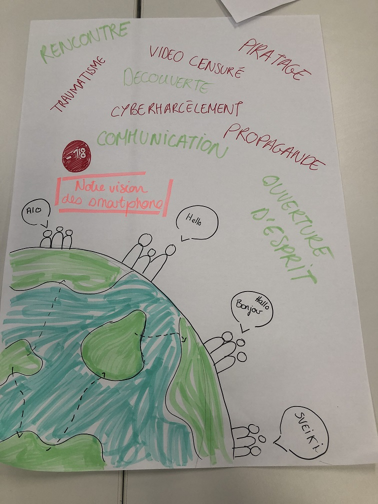
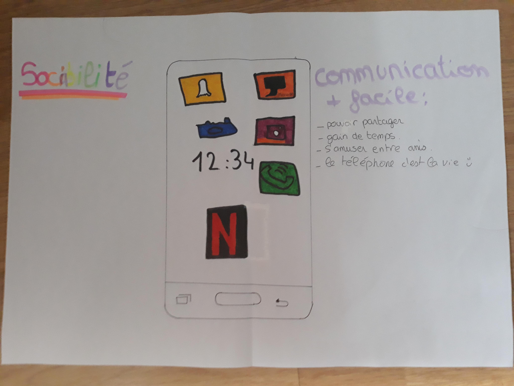
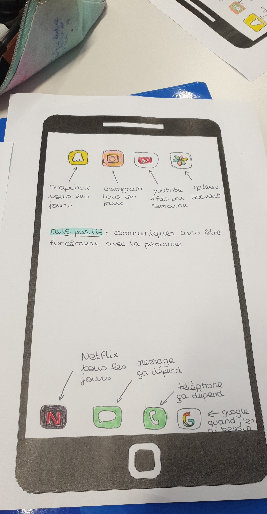
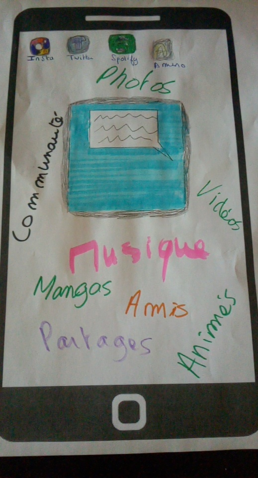

# :mobile_phone: Activité « Dessine ton smartphone »

???+ quote "Source"
    *Adapté d'une activité proposée sur le site de l'[académie de Nantes](https://www.pedagogie.ac-nantes.fr/documentation/enseignement/traam/un-exemple-de-progression-en-sciences-numeriques-et-technologie-1295559.kjsp){ target="_blank" } par Mme. Claire Chignard, professeure documentaliste au Lycée Honoré d'Estienne d'Orves, Carquefou.*

!!! success "À télécharger"
    - [Télécharger le modèle](SNT%20Doc%20élève%20S01.pdf){ target="_blank" } - *Modèle à utiliser pour l'activité.*  
    Si je n'ai pas pu vous fournir ce modèle et que vous n'avez pas la possibilité de l'imprimer chez vous, vous pouvez travailler sur une **feuille blanche A4** classique.

**Individuellement sur une feuille A4** :

Illustre à l'aide de **textes**, de **schémas**, de **dessins**, d'**icônes**... etc. ce qu'évoque pour toi le **smartphone et son usage** (aussi bien le positif que le négatif) dans la société numérique du XXIe siècle.

- Prends en photo ton travail avec ton smartphone.
- Envoie-moi la photo via l'onglet [Rendu des travaux](../../rendus.md)

Si vous êtes d’accord, je mettrai vos chefs-d’œuvre sur le site (**de manière anonyme**), pour que chacun puisse voir ceux des autres !

!!! warning "IMPORTANT"
    Votre travail ne doit pas contenir d'éléments permettant de **vous identifier** (noms, prénoms, etc). Toutefois, pour que je sache quel élève a rendu quel travail, merci de **renommer votre photo** en y ajoutant **votre nom de famille**.

    :thumbsup: Ce travail ne sera pas noté. Toutefois, j'octroierai **un point bonus** à la prochaine interrogation aux élèves qui auront rendu un travail sérieux !

## Quelques exemples

Voici quelques **exemples** pour vous donner des idées :

??? tip "Exemple 1"
    

??? tip "Exemple 2"
    

??? tip "Exemple 3"
    

??? tip "Exemple 4"
    