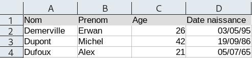

# Cours - Les données structurées

## Vidéo d'introduction

<iframe width="560" height="315" src="https://youtube-nocookie.com/embed/IJJgcZ2DEs0" title="YouTube video player" frameborder="0" allow="accelerometer; autoplay; clipboard-write; encrypted-media; gyroscope; picture-in-picture; web-share" allowfullscreen></iframe>

## Présentation des tables de données

Les données représentées en **tables** se présentent ainsi (image issue de [info.blaisepascal.fr](https://info.blaisepascal.fr/nsi-traitement-des-donnees-en-tables)):


## Le format CSV

Un fichier texte **CSV**:

* Permet de représenter des **données structurées**.
* Est couramment utilisé pour **importer** ou **exporter** des données d'une **feuille de calcul**.
* **Chaque ligne correspond à une ligne du tableau**.
* **Chaque colonne** est séparée par **un séparateur**, ou **délimiteur** (souvent une **virgule** ou un **point-virgule**)

La **feuille de calcul** suivante :



... donne un fichier **CSV** contenant :

```lua
Nom,Prenom,Age,Date naissance
Demerville,Erwan,26,03/05/95
Dupont,Michel,42,19/09/86
Dufoux,Alex,21,05/07/65
```

Chaque ligne correspond à un **enregistrement** (= **structure de données** éventuellement différentes).  
La première ligne définit les **descripteurs** (également appelés **attributs**, **clés**, **champs**).

## Les banques de données

Il existe des **banques de données libres** contenant des **bases de données** que vous pouvez **librement** télécharger dans **plusieurs formats** (*CSV*, *JSON*, *Excel*) et utiliser.

Par exemple :

- [https://data.education.gouv.fr](https://data.education.gouv.fr){ target="_blank" } : plateforme mise en place par le gouvernement et contenant de nombreuses **données du ministère de l'éducation nationale**,
- [https://www.data.gouv.fr/fr/](https://www.data.gouv.fr/fr/){ target="_blank" } : d'autres données libres proposées par le gouvernement (données géographiques, agriculture, énergies...)
- [https://donnees.banquemondiale.org/](https://donnees.banquemondiale.org/){ target="_blank" } : données de la banque mondiale,
- etc. Il en existe plein d'autres, pas uniquement francophones.