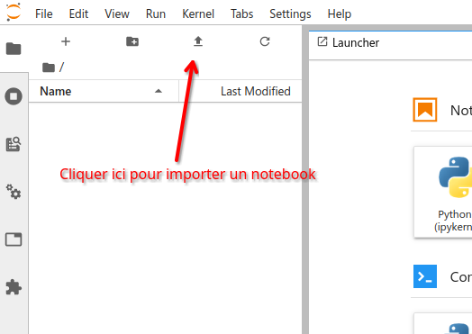

# TP - Manipulation de tables en Python

## TP - Données sur les survivants du Titanic

!!! success "À télécharger"
    Voici un **notebook** portant sur la **manipulation de données** sur les **survivants de la catastrophe du Titanic**.  

    

    [:material-cursor-default-click: Télécharger le notebook](src/TP_Titanic/TP_Titanic.ipynb){ style="font-size:1.5em" target="_blank" }
    

    !!! question "Ouvrir le notebook sur *Jupyter* via **Anaconda**"
        Pour travailler sur *Jupyter* directement **sur votre machine**, suivez les **instructions suivantes** :

        - **déplacez** (ou copiez/collez) le **notebook** `TP_Titanic.ipynb` dans votre **répertoire de travail**.  
        <u>Rappel</u> : après téléchargement, votre fichier se trouve **sur votre bureau**,
        - [cliquez ici](src/jp.bat){ target="_blank" } pour télécharger le fichier [jp.bat](src/jp.bat){ target="_blank" }, et placez-le **au même endroit** que votre **notebook** (dans votre répertoire de travail).
        - **double-cliquez** sur le fichier `jp.bat` pour l'ouvrir : *Jupyter* devrait automatiquement se lancer dans votre **navigateur**.
        - Ouvrez `TP_Titanic.ipynb` depuis *Jupyter*.

    ??? question "Ouvrir le notebook sur *Jupyter* via l'**ENT**"
        - Rendez-vous sur la [liste d'applications de votre ENT](https://enthdf.fr/welcome){ target="_blank" }, puis ouvrez l'application [Jupyter](https://jupyter-crhf.support-ent.fr/){ target="_blank" } :
        
        - Vous pouvez maintenant **importer le notebook** `TP_Titanic.ipynb` téléchargé ci-dessus avec le bouton d'importation (voir image ci-dessous) :
          
        <u>Rappel</u> : après téléchargement, votre fichier se trouve **sur votre bureau**
        - **Double-cliquez** sur le notebook `TP_Titanic.ipynb` que vous avez importé pour l'**ouvrir**.

## Un autre TP sur le traitement de données

Si vous avez terminé le TP précédent, voici un autre **TP** pour vous entraîner à la **manipulation de données** de divers **fichiers** `.csv`.

!!! success "À télécharger"
    Téléchargez le **notebook suivant** :

    

    [:material-cursor-default-click: Télécharger le notebook](src/traitement_donnees/TP_traitement_donnees.ipynb){ target="_blank" }
    

    Ouvrez le **notebook** `TP_traitement_donnees.ipynb` avec **Jupyter notebook**.

    !!! question "Ouvrir le notebook sur *Jupyter* via **Anaconda**"
        Pour travailler sur *Jupyter* directement **sur votre machine**, suivez les **instructions suivantes** :

        - **déplacez** (ou copiez/collez) le **notebook** `TP_traitement_donnees.ipynb` dans votre **répertoire de travail**.  
        <u>Rappel</u> : après téléchargement, votre fichier se trouve **sur votre bureau**,
        - [cliquez ici](src/jp.bat){ target="_blank" } pour télécharger le fichier `jp.bat`, et placez-le **au même endroit** que votre **notebook** (dans votre répertoire de travail).
        - **double-cliquez** sur le fichier `jp.bat` pour l'ouvrir : *Jupyter* devrait automatiquement se lancer dans votre **navigateur**.
        - Ouvrez `TP_traitement_donnees.ipynb` depuis *Jupyter*.

    ??? question "Ouvrir le notebook sur *Jupyter* via l'**ENT**"
        - Rendez-vous sur la [liste d'applications de votre ENT](https://enthdf.fr/welcome){ target="_blank" }, puis ouvrez l'application [Jupyter](https://jupyter-crhf.support-ent.fr/){ target="_blank" } :
        
        - Vous pouvez maintenant **importer le notebook** `TP_traitement_donnees.ipynb` téléchargé ci-dessus avec le bouton d'importation (voir image ci-dessous) :
          
        <u>Rappel</u> : après téléchargement, votre fichier se trouve **sur votre bureau**
        - **Double-cliquez** sur le notebook `TP_traitement_donnees.ipynb` que vous avez importé pour l'**ouvrir**.