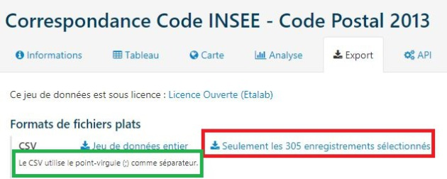

# TP - Utilisation d'un tableur

## Partie 1 - Prise en main de LibreOffice Calc

[:material-cursor-default-click: Télécharger le fichier `Exemple_table.csv`](src/TP_tableur/Exemple_table.csv){ style="font-size:1.5em" target="_blank" }

Pour chaque bloc "À faire" qui suit, effectuer les opérations indiquées.

!!! note "À faire 1"
    1. Une fois que vous avez **téléchargé votre fichier**, rendez-vous sur votre **dossier de téléchargements** (via le gestionnaire de fichiers), puis **ouvrez le fichier** `Exemple_table.csv` avec le logiciel **LibreOffice Calc** (++"clic droit"++, ++"ouvrir avec"++, ++"LibreOffice"++).
    2. Assurez-vous que le **séparateur** `virgule` soit bien **coché**.
    3. Afin que les données correspondant au **descripteur** `"Date de naissance"` soient gérées en tant que **date**, cliquer sur la **colonne** et sélectionner `"Date (JMA)"`.

    

    { width="500" }
    

!!! note "À faire 2 - Le *tri*"
    Il est possible de **trier les données** selon **une ou plusieurs colonnes** (un ou plusieurs **descripteurs**).

    Dans le menu **"Données"**, **cliquer** sur ==**"Trier..."**==.

    

    
    

    **Cocher la case** `"La plage contient des étiquettes de colonne"`.

    

    { width="350" }
    

    ---

    1. Effectuer un **tri croissant sur le nom**, la table de données devrait s'afficher ainsi :  
    

    
    

    2. Effectuer maintenant un **tri décroissant sur le prénom** et un **tri croissant sur la date de naissance**, la table de données devrait s'afficher ainsi :  
    

    
    

!!! note "À faire 3 - Les *filtres*"
    Pour montrer seulement **certaines lignes** (donc certains objets) du fichier, on utilise des **filtres**.

    **Sélectionner** tout le **tableau**, puis aller dans le menu **"Données"**, et cliquer sur ==**"AutoFiltre"**==.

    

    
    

    Des **listes déroulantes** apparaissent pour chaque **colonne** (descripteur).

    

    
    

    Pour **filtrer les personnes nées en 2005**, **décocher** "Tout" puis **cocher** "2005".

    

    

    
    

    ---

    On souhaite maintenant **filtrer les personnes dont le prénom contient la lettre "c"**.  
    Dans le **menu déroulant** du "Prénom", **cliquer** sur ==**"Filtre standard"**== (dans le menu "Filtrer par condition"), et choisir ensuite la condition **"Contient"**.

    

    

    
    

    ---

    Pour **supprimer un filtre**, re-cliquer sur le bouton **"Autofiltre"** après avoir **sélectionné votre tableau**.

!!! note "À faire 4 - Les *calculs*"
    Les **calculs** permettent de **déterminer le nombre d'objets** partageant **un** ou **plusieurs descripteurs** communs.

    Les **calculs** commencent par le signe `=` et sont réalisés à l'aide de **fonctions**.

    **Cliquer** sur la cellule **F1** puis sur le bouton ==**fx**== (Assistant *fonction*).

    

    

    { width="400" }
    

    ---

    **Compter le nombre de lignes** contenant une **donnée** (non vide) pour le **descripteur** "Nom" (la **colonne A entière** se note `A:A`), en utilisant la **fonction** `NBVAL`.

    

    { width="500" }
    

    **Cliquer sur "OK"**, la cellule **F1** devrait maintenant afficher **6**.  
    Cela correspond bien au **total de la ligne des descripteurs** et des **5 objets**.

    ---

    **Compter le nombre de personnes** dont le **prénom contient la lettre "c"**, **en utilisant** la **fonction** `NB.SI`. On exclut la **1ère ligne de la plage** (`B2:B6`).  
    On utilisera le **critère** `"*c*"`.

    

    { width="500" }
    

    **Cliquer sur "OK"**, la cellule **F1** devrait maintenant afficher **3**.  
    Cela correspond bien aux 2 "Camille" et à "Alice".

    ---

    **Compter le nombre de personnes nées avant 2005** (`"<01/01/2005"`), **en utilisant** la **fonction** `NB.SI`. On exclut la **1ère ligne de la plage** (`D2:D6`).

    

    { width="500" }
    

    **Cliquer sur "OK"**, la cellule **F1** devrait maintenant afficher **2**.  
    Cela correspond bien aux 2 "Camille".

    ---

    Enfin, **compter le nombre de filles** (`"F"`) **nées après 2004** (`">=01/01/2005"`), **en utilisant** la **fonction** `NB.SI.ENS`.

    

    { width="500" }
    

!!! note "À faire 5 - Les *calculs* (suite)"
    Les **calculs** permettent également de **créer de nouvelles données**.

    Le **calcul** sera alors saisi sur la **2ème ligne d'une colonne vide** puis **dupliqué pour toutes les lignes**.

    ---

    On peut **calculer en temps réel l'âge des personnes**, en utilisant les **fonctions** `ANNEES` et `AUJOURDHUI`.  
    Pour commencer, **calculer** l'**âge de la 1ère personne**.

    

    { width="500" }
    

    On souhaite **l'appliquer à l'ensemble des personnes**.  
    **Cliquer** sur le **carré noir** en **bas à droite de la cellule**, et **faire glisser vers le bas**.

    

    { width="500" }
    

    ---

    On souhaite **calculer la moyenne d'âge des personnes**.  
    **Se placer sur la cellule F7**, puis **utiliser** la **fonction** `MOYENNE`.

    

    { width="500" }
    

## Partie 2 - Les longs métrages Disney

Téléchargez le fichier `csv` suivant :

[:material-cursor-default-click: Télécharger le fichier `Les_longs_metrages_Disney_sans_separateur.csv`](src/TP_tableur/Les_longs_metrages_Disney_sans_separateur.csv){ style="font-size:1.1em" target="_blank" }

Téléchargez le **document-réponse** (vous y écrirez les réponses aux questions) suivant :

[:material-cursor-default-click: Télécharger le fichier `Doc_réponses_partie2.odt`](src/TP_tableur/Doc_réponses_partie2.odt){ style="font-size:1.1em" target="_blank" }

!!! note "Question 1"
    La tableau de données est-elle exploitable ?

??? tip "Indice question 1"
    Observer les données de l'objet sur la ligne 15

**Ouvrir** le **fichier précédent** (`Les_longs_metrages_Disney_sans_separateur.csv`) avec le logiciel ==**Notepad++**== (++"clic droit"++, puis `"Edit with Notepad++"`).

**Télécharger** le **fichier suivant** et l'**ouvrir également** avec ==**NotePad++**==.

[:material-cursor-default-click: Télécharger le fichier `Les_longs_metrages_Disney.csv`](src/TP_tableur/Les_longs_metrages_Disney.csv){ style="font-size:1.1em" target="_blank" }

!!! note "Question 2"
    Quelle est la **différence** entre les deux fichiers ?

Ouvrir maintenant `Les_longs_metrages_Disney.csv` dans ==**LibreOffice Calc**==.  
Au lancement, assurez-vous que la **virgule** soit bien sélectionnée comme séparateur.

!!! note "Question 3"
    **Trier** les **longs métrages** selon leur **titre** par **ordre croissant**.
    
    Vous mettrez une capture d'écran du résultat dans votre document-réponse.

??? tip "Indice question 3"
    Dans le menu **"Données"**, cliquer sur **"Trier..."**.

!!! note "Question 4"
    **Trier** les **longs métrages** selon leur **numéro** de "classique d'animation" (par ordre **décroissant**) et leur **commentaire** (par **ordre croissant**).

    Vous mettrez une capture d'écran du résultat dans votre document-réponse.

??? tip "Indice question 4"
    Il faut réaliser deux tris simultanés : tri1 sur numéro de "classique d'animation" et tri2 sur le commentaire.

!!! note "Question 5"
    **Filtrer** les **longs métrages du XXIe siècle** qui ne sont **pas** des **classiques Disney**.  
    **Trier** le **résultat** par **date de sortie** (ordre **croissant**).

    Vous mettrez une capture d'écran du résultat dans votre document-réponse.

??? tip "Indice question 5"
    Dans le menu **"Données"**, cliquer sur **"AutoFiltre"**.

    XXIe siècle : `date >= 01/01/2000`

    Les longs métrages qui n'ont pas de numéro de "Classique Disney" ne sont pas considérés comme des classiques.

!!! note "Question 6"
    **Filtrer** les **longs métrages** dont le **titre** commence par un "V", qui sont des **classiques Disney** et dont le **commentaire** indique une **coproduction avec Pixar**.

    Vous mettrez une capture d'écran du résultat dans votre document-réponse.

??? tip "Indice question 6"
    Commencer par **filtrer** le **titre** :

    Dans le menu **"Données"**, cliquer sur **"Plus de filtres/Filtre standard"**.  
    Utiliser la condition "Commence par".

!!! note "Question 7"
    **Compter** le **nombre de longs métrages classique Disney** sortis au **XXIe siècle**.

??? tip "Indice question 7"
    Pour **compter** le **nombre de longs métrages classique Disney** (`"*"`) sortis au **XXIe siècle** (`">=01/01/2000"`), on utilise la fonction `NB.SI.ENS`.

!!! note "Question 8"
    **Compter** le **nombre de longs métrages** dont le **titre** ne contient qu'**un seul mot sortis au XXe siècle**.

??? tip "Indice question 8"
    Pour compter le nombre de longs métrages dont le titre ne contient qu'un seul mot (`"<>"&"* *"`) sortis au XXe siècle (`"<01/01/2000"`), on utilise la fonction `NB.SI.ENS`.

## Partie 3 - Les communes des Deux-Sèvres

!!! abstract ""
    De nombreux sites offrent l’accès à leurs données au format ouvert (ou libre) sans aucun obstacle technique et aucune restriction à leurs utilisations, même commerciales.

    Dans un moteur de recherche, saisissez les mots-clés "géolocalisation communes deux sevres csv".

    Parmi les résultats, vous devriez trouver celui du site *opendatasoft.com* : [https://public.opendatasoft.com/explore/dataset/correspondance-code-insee-code-postal/table/](https://public.opendatasoft.com/explore/dataset/correspondance-code-insee-code-postal/table/)

    

    
    

    Dans le menu de gauche, **filtrer** la **liste** pour ne conserver que les **communes des Deux-Sèvres**.  
    **Cliquer** sur "Export".

    

    
    

    Enregistrer le fichier `.CSV` dans votre `H:\Travail` sous le nom `liste_communes_79.csv`.

    Noter que le **séparateur des données** ne sera pas la virgule mais le **point-virgule**.

    ---

    **Ouvrir** le **fichier** `.CSV` avec **LibreOffice Calc**.

    À l'aide de la touche ++"Ctrl"++, sélectionner les colonnes "Altitude moyenne", "Superficie" et "Population" et choisissez le type "Anglais US" indiquant que ce sont des **nombres décimaux** notés avec un **point**.

    

    { width="500" }
    

    **Supprimer** les **colonnes** "département" et "région" ainsi que **toutes les colonnes après** "geo_shape".

    **Enregistrer les modifications**.

Téléchargez le **document-réponse** (vous y écrirez les réponses aux questions) suivant :

[:material-cursor-default-click: Télécharger le fichier `Doc_réponses_partie3.odt`](src/TP_tableur/Doc_réponses_partie3.odt){ style="font-size:1.1em" target="_blank" }

!!! note "Question 1"
    **Combien d'habitants** résident à **Moncoutant** ?

??? tip "Indice question 1"
    Si besoin, rechercher la population de votre commune.

!!! note "Question 2"
    Quelle l'**unité** de l'**altitude** ? Même question pour la **superficie** ?

??? tip "Indice question 2"
    Trouver des **éléments de comparaison** (**altitude** du **Mont-Blanc** soit **4 809m**, **superficie** d'un **terrain de tennis** soit environ **200 m²**)

!!! note "Question 3"
    Quelles **données** contient la colonne "geo_point_2d" ? Pourquoi chaque donnée contient une **virgule** ?

??? tip "Indice question 3"
    "geo" est l’abréviation de "geographic".

!!! abstract ""
    Il faut donc séparer les données contenues dans la colonne "geo_point_2d".

    Sélectionner la **colonne** (cliquer sur la **lettre correspondante**).

    Dans le menu **"Données"**, cliquer sur **"Texte en colonnes..."**

    Choisir la **virgule** comme **séparateur**.

    À l'aide de la touche ++"Ctrl"++, sélectionner les **deux colonnes** et choisissez le type "Anglais US" indiquant que ce sont des **nombres décimaux** notés avec un **point**.
    
    

    
    

    Modifier le **titre** de **chaque colonne**.

    **Enregistrer les modifications**.