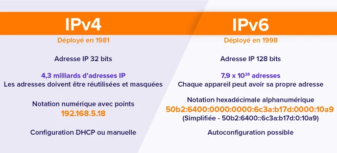
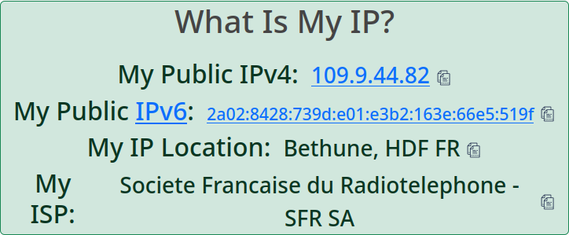
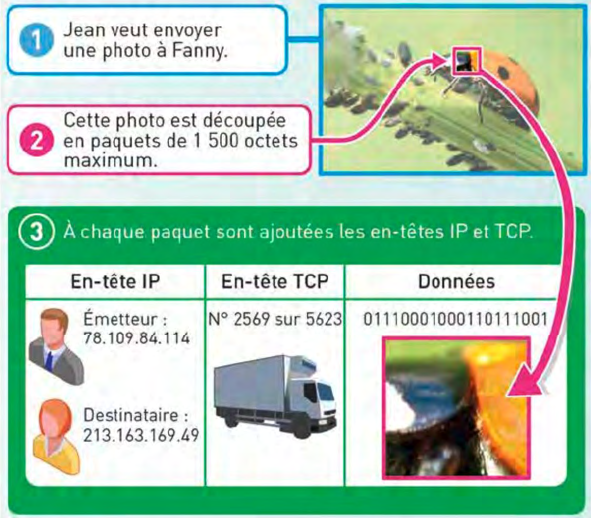
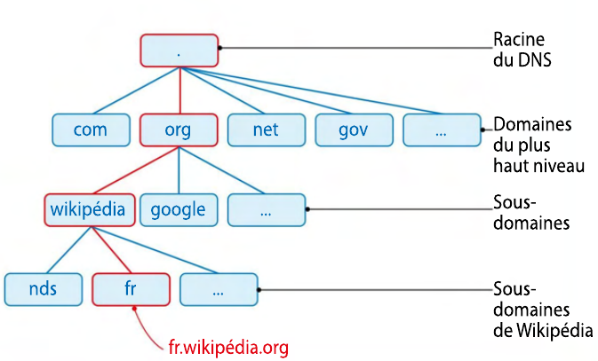
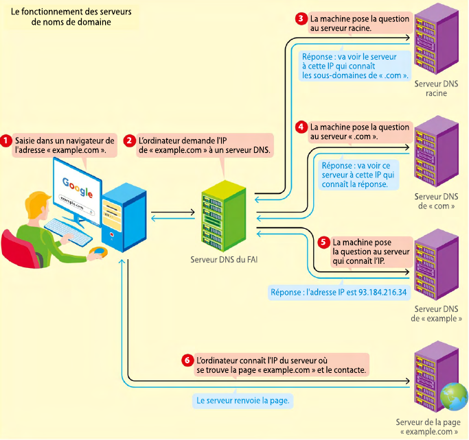

!!! quote "Version PDF de ce cours"
    - [resume_cours_trous.pdf](documents/resume_cours_trous.pdf){ target="_blank" } - version du cours à trous,
    - [resume_cours.pdf](documents/resume_cours.pdf){ target="_blank" } - version du cours complété.

# Cours - Internet

## Définition d'Internet

!!! abstract "L'essentiel"
    ==**Internet**== constitue un vaste **réseau de machines interconnectées** (c'est un ==**réseau de réseaux**==, un réseau mondial constitué de nombreux **sous-réseaux locaux et régionaux**), à travers lequel circulent d'énormes volumes de données, atteignant actuellement environ **168 millions de téraoctets par mois**. Les **échanges d'informations** entre ces **machines** s'effectuent au moyen de ==**requêtes**==, où l'**ordinateur émettant une requête** est désigné comme ==**client**==, tandis que celui y **répondant** est qualifié de ==**serveur**==.

Les **données** transférées d'un point à un autre peuvent inclure des **textes**, des **images**, des **vidéos**, et d'**autres types d'informations**.

Les **dispositifs connectés à Internet,** tels que les **ordinateurs**, les **serveurs**, et autres **équipements**, **communiquent** entre eux en **envoyant** et **recevant** des **informations**. Cette communication peut prendre **diverses formes**, comme la **navigation sur le web**, l'**envoi de courriels**, le **partage de fichiers**, etc.

!!! abstract "Clients et serveurs"
    Les machines utilisent des ==**requêtes**== pour **demander des informations spécifiques** à **d'autres machines**. Une **requête** est essentiellement une demande envoyée d'un **dispositif** (appelé **client**) à un autre (appelé **serveur**) pour **obtenir des données** ou **effectuer une action** particulière.

    ==**Client**== : Un **client** est un **dispositif**, généralement un **ordinateur**, qui **initie une demande** en envoyant une **requête**. Les **clients** demandent des **informations** ou des **services** à **d'autres dispositifs** sur le **réseau**.

    ==**Serveur**== : Un **serveur** est un **dispositif** qui **répond aux requêtes** des **clients** en fournissant les **informations demandées** ou en effectuant l'**action spécifiée**. Les **serveurs** jouent un rôle crucial dans le fonctionnement d'**Internet** en **hébergeant** et en **distribuant** des données aux utilisateurs.

    ??? question "Exemple : accéder à une page web"
        1. **Client (Navigateur Web)** :
            - L'utilisateur ouvre un navigateur web (client) sur son ordinateur.
            - Il entre l'adresse URL d'une page web dans la barre d'adresse du navigateur.
        2. **Émission de la requête par le client** :
            - Le navigateur envoie une requête au serveur web hébergeant la page web demandée. Cette requête contient des informations sur le type de contenu souhaité et d'autres détails.
        3. **Serveur Web** :
            - Le serveur web reçoit la requête du navigateur client.
            - Il interprète la requête et identifie la page web demandée.
        4. **Traitement de la requête par le serveur** :
            - Le serveur web récupère la page web demandée à partir de son stockage ou génère dynamiquement le contenu en fonction des données disponibles.
        5. **Réponse du Serveur au Client** :
            - Une fois la page web prête, le serveur envoie une réponse au navigateur client.
            - La réponse contient le contenu de la page web ainsi que des informations supplémentaires telles que le code de statut HTTP, les en-têtes, etc.
        6. **Affichage du Contenu par le Client (Navigateur)** :
            - Le navigateur client reçoit la réponse du serveur.
            - Il interprète le contenu reçu (qui peut inclure du HTML, des images, des scripts, etc.) et l'affiche à l'utilisateur.

<figure markdown="span">
  { width="400" }
  <figcaption>Modèle client-serveur <i>(source : <a href="https://fr.wikipedia.org/wiki/Client-serveur" target="_blank">Wikipédia</a>)</i></figcaption>
</figure>

## Indépendance par rapport au réseau physique

!!! abstract "L'essentiel"
    Les **ordinateurs** sont **connectés les uns aux autres** par **différents moyens**, que ce soit à travers des ==**connexions filaires**== telles que la ==**fibre optique**== ou l'==**ADSL**==, ou via des ==**connexions sans fil**== comme le ==**Wifi**== et le ==**Bluetooth**==. **Internet** est **dissocié du réseau physique** grâce à des ==**protocoles de communication**==, ce qui permet de passer d'un **type de connexion** à un **autre** en assurant la **fluidité des communications**.  
    À titre d'exemple, un **smartphone** peut se connecter à **Internet** en transitant du **Wifi d'une box** à la **4G d'une antenne**, illustrant ainsi la flexibilité offerte par ces protocoles.

!!! success "Débits de quelques liaisons"
    
    

    <table class="tg">
    <thead>
    <tr>
        <th class="tg-fymr">Connexion avec fil</th>
        <th class="tg-fymr">Connexion sans fil</th>
    </tr>
    </thead>
    <tbody>
    <tr>
        <td class="tg-0pky">Fibre optique: très haut débit,  jusqu'à 100 Mo/s  (<i>mégaoctets par seconde</i>)</td>
        <td class="tg-0pky">4G : pour la téléphonie, 10 à 20 Mo/s. </td>
    </tr>
    <tr>
        <td class="tg-0pky" rowspan="2">ADSL : utilise  les lignes téléphoniques, environ 2,75 Mo/s.</td>
        <td class="tg-0pky">Wifi : jusqu'à 7 Mo/s.</td>
    </tr>
    <tr>
        <td class="tg-0pky">Bluetooth : pour connecter des appareils proches par ondes radios, 0,4 Mo/s.</td>
    </tr>
    </tbody>
    </table>
    

    { width="300" } { width="350" }

## La circulation des données

!!! abstract "L'essentiel"
    Les ==**données**== sont fragmentées en ==**paquets**== de **bits**, et des machines appelées ==**routeurs**== dirigent ces **paquets** à travers le **réseau** jusqu'à leur **destination**, où ils sont **reconstitués**. Lorsqu'un **routeur** reçoit un **paquet**, il examine l'**adresse IP de destination**, déterminant ainsi le **prochain routeur** par lequel le **paquet** doit transiter pour atteindre sa **destination**.
    
    Dans un réseau doté de plusieurs **liaisons**, divers **itinéraires** sont généralement envisageables. Le routeur sélectionne **le chemin optimal** en considérant des facteurs tels que l'**encombrement du réseau** ou d'**éventuelles pannes** (par exemple, si un câble tombe en panne quelque part sur le réseau, il faudra faire passer les paquets par un autre chemin, les routeurs détermineront alors de nouveaux chemins pour faire transiter les données).

Sur Internet, il existe de **nombreux routeurs**, et de multiples **routes** pour **transmettre un paquet de données** d'un point **A** à un point **B** :

<figure markdown="span">
  { width="600" }
  <figcaption>Exemple de routage dans un réseau</figcaption>
</figure>

!!! success "La circulation des données sur Internet"
    Lorsque l'on transmet une **donnée** à travers le réseau, cette donnée n'est pas transmise d'un coup mais est ==**découpée** en **plusieurs paquets** d'une **taille maximale de 1 500 octets**==.

    Ainsi, s'il y a un **problème avec le réseau**, seuls les **paquets perdus** doivent être **ré-émis**, plutôt que l'entièreté de la donnée.

    

    
    

!!! abstract "Le rôle des **routeurs**"
    ==Les **routeurs** permettent de **faire le lien entre plusieurs sous-réseaux**.==

    Voici un **exemple de réseau**, contenant **un seul routeur** permettant de **faire transiter des paquets** entre un **réseau 1** et un **réseau 2** :

    <figure markdown="span">
    
    <figcaption>Un exemple de réseau avec un seul routeur (source : <a href="https://spe-lavoisier.fr/TNSI/Cours/Chapitre10_fichiers/reseau2.png" target="_blank">spe-lavoisier.fr</a>)</figcaption>
    </figure>

    Voici un **autre exemple de réseau** avec **trois routeurs** :

    <figure markdown="span">
    
    <figcaption>Exemple de réseau avec <b>trois routeurs</b> (<b>R1</b>, <b>R2</b> et <b>R3</b>) 
    On distingue <b>6 sous-réseaux</b> identifiés par les lettres <i>A</i>, <i>B</i>, <i>C</i>, <i>D</i>, <i>E</i> et <i>F</i>.</figcaption>
    </figure>

## Les protocoles IP et TCP

### Les adresses IP

!!! abstract "Qu'est-ce qu'une **adresse IP** ?"
    Chaque **machine** connectée à **Internet** est **identifiée sur le réseau** grâce à son ==**adresse IP**== (*Internet Protocole*). Une ==**adresse IP**== se compose de **quatre nombres** codés sur **8 bits**, et donc compris entre **0** et **255**.

    Si l'on fait le calcul, une **adresse IP** est constituée de $4 \times 8 bits = 32 bits$, ce qui fait un total de $2^32$ possibilités, soit ==**4 294 967 296**== **adresses IP** différentes possibles.

    <figure markdown="span">
    { width="400" }
    <figcaption>Exemple d'adresse IP (source : <a href="https://fr.wikipedia.org/wiki/Adresse_IP" target="_blank">Wikipédia</a>)</figcaption>
    </figure>

!!! abstract "IPv4 vs. IPv6"
    Dans le cadre de ce cours, on se limitera au **protocole IPv4** (*Internet Protocol version 4*), qui est la **première version** d'==**Internet Protocol (*IP*)**== à avoir été largement déployée, mais qui reste encore aujourd'hui **la base de la majorité des communications** sur **Internet**.
    
    Les **adresses IPv4** sont des **adresses** sur **32 bits** constituées de **4 nombres** de `0` à `255`, comme par exemple `192.168.1.25` ou `255.255.255.25`. Il y a donc $2^32$ **adresses IP possibles** (environ **4,3 milliards**). Cela paraît beaucoup, mais étant donné la quantité de plus en plus importante d'appareils en tous genres connectés à internet à travers le monde, le **nombre d'adresses IP utilisables** devient **insuffisant**.
    
    Pour palier à la **limitation** des **adresses IPv4**, une évolution du **protocole IP**, appelée **IPv6**, a vu le jour. Une **adresse IPv6** contient **128 bits**, contre **32 bits pour IPv4**, ce qui fait un total de $2^128$, soit **plus de 340 sextillions d'adresses IP différentes**, ce qui est **énorme**. Avec ce protocole, le problème de limitation du nombre d'adresses IP est donc définitivement réglé.

    <figure markdown="span">
    
    <figcaption>IPv4 vs. IPv6 (source : <a href="https://www.avast.com/fr-fr/c-ipv4-vs-ipv6-addresses" target="_blank">Avast</a>)</figcaption>
    </figure>

!!! question "Voir mon adresse IP"
    Prenons l'exemple du **réseau de votre maison**. Chez vous, lorsque vous utilisez un **ordinateur** ou tout autre appareil connecté à une **box Internet**, vous possédez en réalité **deux adresses IP** :
    
    - une ==**adresse IP locale**== : c'est l'**adresse IP** de votre **machine** sur le **réseau local** de **chez** vous. Si vos *parents*, vos *frères*, vos *sœurs*, etc, sont connectés avec leur *ordinateur*, leur *tablette*, leur *smartphone* ou encore leur *TV* à une **même box Internet** (à l'aide d'une liaison **Wi-Fi** par exemple), ils possèdent chacun une **adresse IP locale**, qui permet d'**identifier leur appareil** sur **votre réseau**.  
    Vous pouvez **voir cette adresse IP**, par exemple sur **Windows** en ouvrant un **invite de commande** et en saisissant la **commande** `ipconfig` :  
      
    On peut voir dans les **informations de la carte réseau Wi-Fi** que l'**adresse IPv4** sur le **réseau local** est `192.168.1.120`.  
    La **carte réseau** dispose également d'une **adresse IPv6**. Ainsi, selon les besoins, l'une ou l'autre version du **protocole IP**, **IPv4** et **IPv6**, peut être utilisée.  
    L'==**adresse de la "passerelle par défaut"**== correspond à l'**adresse IP du routeur qui vous connecte à Internet** (c'est-à-dire au **réseau mondial**). Il s'agit généralement de votre **box Internet**. Souvent, et c'est le cas **ici**, cette adresse en **IPv4** est `192.168.1.1`.  
    Si vous saisissez l'**adresse de la passerelle** dans la **barre d'adresse** de votre **navigateur web**, vous accéderez à l'**interface de votre box Internet**, vous permettant de la configurer.  
    *Note* : La plupart des **ordinateurs** disposent d'une **carte réseau Wi-Fi** et d'une **carte réseau Ethernet** (permettant de relier l'**ordinateur** à un **réseau** avec un câble *RJ45*, aussi appelé *câble Ethernet*). Les **ordinateurs du lycée** par exemple sont reliés au **réseau** avec un **câble Ethernet**.  
    Si votre **ordinateur** est connecté à **deux réseaux différents** avec **deux interfaces différentes** (par exemple s'il est connecté à **un réseau en Wi-Fi** et à **un autre réseau en Ethernet**), chaque **interface réseau** aura sa **propre adresse IP sur le réseau**.

    - une ==**adresse IP sur le réseau mondial (Internet)**== : toutes les **machines** connectées à une **même box Internet** possèdent une **même adresse IP sur Internet**, il s'agit en effet de l'**adresse IP de la box Internet**. Cette **adresse IP** est ==**publique**==, et peut être récupérée, utilisée et stockée par tous les **services** que vous utilisez sur **Internet**.
    De nombreux **services** comme [WhatIsMyIP](https://www.whatismyip.com/){ target="_blank"} vous permettent de **voir cette adresse IP publique** :

    

    { width="500" }
    

### Le rôle des protocoles IP et TCP

!!! abstract "L'essentiel"
    Les **échanges de données** peuvent s'effectuer de manière **fiable** grâce à l'**utilisation de ==protocoles de communication==**. Ces **protocoles** consistent en des ==**règles d'adressage, de transport et de contrôle d'intégrité des paquets**==.
    
    Chaque ==**paquet**== circulant sur **Internet** est enrichi d'**en-têtes**, notamment les ==**en-têtes IP** et **TCP**==, qui **renferment** des **informations additionnelles** correspondant à ces **protocoles de communication** :

    - le ==**protocole IP**== ajoute un ==**en-tête**== contenant les ==**adresse IP des ordinateurs émetteurs et récepteurs du paquet**==. Il gère le **bon adressage des données**.
    - le ==**protocole TCP**== ajoute un ==**en-tête**== qui permet, entre autres, de **numéroter les paquets** de manière à pouvoir les **ré-assembler dans le bon ordre** une fois **reçus** par le **destinataire**.  
    Ce protocole s'assure par ailleurs que **tous les paquets soient bien reçus**, en utilisant un système d'**accusés de réception**. Pour **chaque paquet émis**, un **accusé de réception** doit être **reçu en retour**. Ainsi, si un accusé de reception attendu n'est pas reçu, le **paquet concerné** est **ré-émis**.

    <figure markdown="span">
    { width="400" }
    <figcaption>Protocoles TCP et IP (source : Delagrave SNT 2de 2023)</figcaption>
    </figure>

## DNS (Domain Name System)

!!! abstract "L'essentiel"
    Comme nous l'avons vu précédemment, les **machines**, appelées ==**serveurs**==, qui **hébergent** les **pages web** que nous visitons chaque jour, possèdent une **adresse IP**.
    
    Ainsi, pour **accéder à une page web**, on devrait normalement saisir l'**adresse IP du serveur** dans la **barre d'adresse** de notre **navigateur web**.  
    Par exemple, si vous **saisissez l'adresse** `173.194.213.94` dans la **barre d'adresse** de votre **navigateur** (*Firefox*, *Chrome*, *Edge*, etc), vous devriez accéder au [site de Google](https://google.fr/){ target="_blank" } français.

    Toutefois, généralement, lorsque l'on souhaite accéder à un **site web**, on saisit plutôt une **adresse** du type `www.google.fr` ou même juste `google.fr`.
    
    Des ==**adresses symboliques**==, constituées de **courts textes plus mémorables** pour l'être humain, sont **associées aux adresses IP**. La **mise en correspondance** entre une **adresse IP** et une **adresse symbolique** est gérée par un ==**annuaire DNS (Domain Name System)**==.

    Le ==**DNS**== est organisé en ==**domaines**== et en **==sous-domaines**==, chacun correspondant à des **ensembles d'adresses** gérées en commun.  
    Chaque **séparation de niveau** d'un **domaine** est **matérialisée par un point**. Par exemple, dans `wikipedia.org` :

    - le **domaine** de **plus haut-niveau** est *fr.wikipedia.==org==*.
    - le **domaine** de **niveau inférieur** est *fr.==wikipedia==.org*. ; on dit que `wikipedia` est un **sous-domaine** du **domaine** `org`.
    - le **domaine** de **niveau encore inférieur** est *==fr==.wikipedia.org*. ; on dit que `fr` est un **sous-domaine** de `wikipedia`.

    <figure markdown="span">
    { width="500" }
    <figcaption>Organisation hiérarchique de l'annuaire DNS (source : Delagrave SNT 2de 2023)</figcaption>
    </figure>

!!! abstract "Répartition de l'annuaire DNS"
    Étant donné que le **nombre d'adresses** sur **Internet** est **colossal**, l'**annuaire DNS** est ==**distribué sur plusieurs machines**==. Ces machines **interagissent entre elles** en **lançant des requêtes** et en y **répondant** pour déterminer l'**adresse IP de la machine** hébergeant la **page Web recherchée**.

    <figure markdown="span">
    
    <figcaption>Fonctionnement des serveurs de noms de domaine (source : Delagrave SNT 2de 2023)</figcaption>
    </figure>