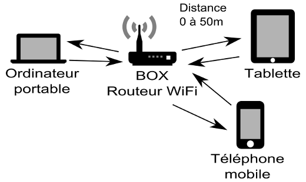
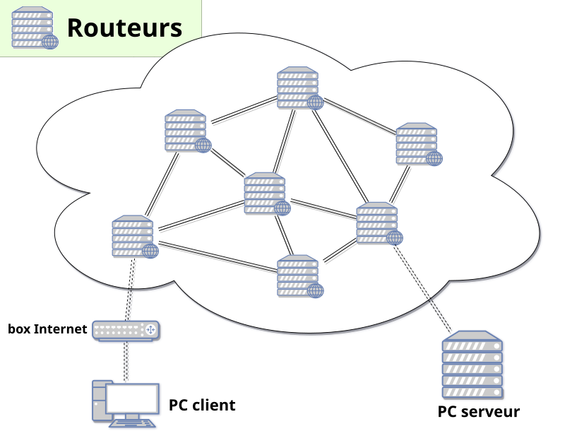
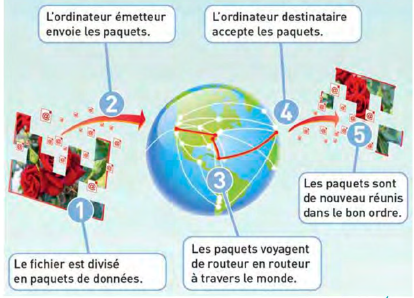
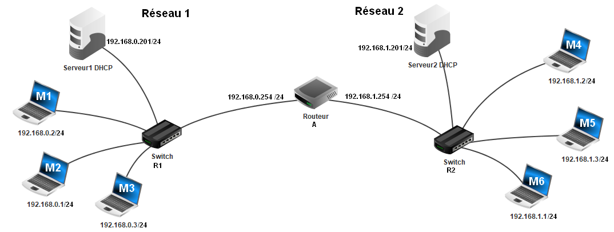
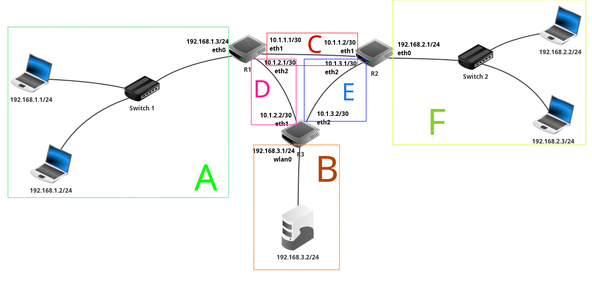

!!! quote "Version PDF de ce cours"
    - [resume_cours_trous.pdf](documents/resume_cours_trous.pdf) - version du cours à trous,
    - [resume_cours.pdf](documents/resume_cours.pdf) - version du cours complété.

# Cours - Internet

## Définition d'Internet

!!! abstract "L'essentiel"
    ==**Internet**== constitue un vaste **réseau de machines interconnectées** (c'est un ==**réseau de réseaux**==, un réseau mondial constitué de nombreux **sous-réseaux locaux et régionaux**), à travers lequel circulent d'énormes volumes de données, atteignant actuellement environ **168 millions de téraoctets par mois**. Les **échanges d'informations** entre ces **machines** s'effectuent au moyen de ==**requêtes**==, où l'**ordinateur émettant une requête** est désigné comme ==**client**==, tandis que celui y **répondant** est qualifié de ==**serveur**==.

Les **données** transférées d'un point à un autre peuvent inclure des **textes**, des **images**, des **vidéos**, et d'**autres types d'informations**.

Les **dispositifs connectés à Internet,** tels que les **ordinateurs**, les **serveurs**, et autres **équipements**, **communiquent** entre eux en **envoyant** et **recevant** des **informations**. Cette communication peut prendre **diverses formes**, comme la **navigation sur le web**, l'**envoi de courriels**, le **partage de fichiers**, etc.

!!! abstract "Clients et serveurs"
    Les machines utilisent des ==**requêtes**== pour **demander des informations spécifiques** à **d'autres machines**. Une **requête** est essentiellement une demande envoyée d'un **dispositif** (appelé **client**) à un autre (appelé **serveur**) pour **obtenir des données** ou **effectuer une action** particulière.

    ==**Client**== : Un **client** est un **dispositif**, généralement un **ordinateur**, qui **initie une demande** en envoyant une **requête**. Les **clients** demandent des **informations** ou des **services** à **d'autres dispositifs** sur le **réseau**.

    ==**Serveur**== : Un **serveur** est un **dispositif** qui **répond aux requêtes** des **clients** en fournissant les **informations demandées** ou en effectuant l'**action spécifiée**. Les **serveurs** jouent un rôle crucial dans le fonctionnement d'**Internet** en **hébergeant** et en **distribuant** des données aux utilisateurs.

    ??? question "Exemple : accéder à une page web"
        1. **Client (Navigateur Web)** :
            - L'utilisateur ouvre un navigateur web (client) sur son ordinateur.
            - Il entre l'adresse URL d'une page web dans la barre d'adresse du navigateur.
        2. **Émission de la requête par le client** :
            - Le navigateur envoie une requête au serveur web hébergeant la page web demandée. Cette requête contient des informations sur le type de contenu souhaité et d'autres détails.
        3. **Serveur Web** :
            - Le serveur web reçoit la requête du navigateur client.
            - Il interprète la requête et identifie la page web demandée.
        4. **Traitement de la requête par le serveur** :
            - Le serveur web récupère la page web demandée à partir de son stockage ou génère dynamiquement le contenu en fonction des données disponibles.
        5. **Réponse du Serveur au Client** :
            - Une fois la page web prête, le serveur envoie une réponse au navigateur client.
            - La réponse contient le contenu de la page web ainsi que des informations supplémentaires telles que le code de statut HTTP, les en-têtes, etc.
        6. **Affichage du Contenu par le Client (Navigateur)** :
            - Le navigateur client reçoit la réponse du serveur.
            - Il interprète le contenu reçu (qui peut inclure du HTML, des images, des scripts, etc.) et l'affiche à l'utilisateur.

<figure markdown="span">
  { width="400" }
  <figcaption>Modèle client-serveur <i>(source : <a href="https://fr.wikipedia.org/wiki/Client-serveur" target="_blank">Wikipédia</a>)</i></figcaption>
</figure>

## Indépendance par rapport au réseau physique

!!! abstract "L'essentiel"
    Les **ordinateurs** sont **connectés les uns aux autres** par **différents moyens**, que ce soit à travers des ==**connexions filaires**== telles que la ==**fibre optique**== ou l'==**ADSL**==, ou via des ==**connexions sans fil**== comme le ==**Wifi**== et le ==**Bluetooth**==. **Internet** est **dissocié du réseau physique** grâce à des ==**protocoles de communication**==, ce qui permet de passer d'un **type de connexion** à un **autre** en assurant la **fluidité des communications**.  
    À titre d'exemple, un **smartphone** peut se connecter à **Internet** en transitant du **Wifi d'une box** à la **4G d'une antenne**, illustrant ainsi la flexibilité offerte par ces protocoles.

!!! success "Débits de quelques liaisons"
    
    

    <table class="tg">
    <thead>
    <tr>
        <th class="tg-fymr">Connexion avec fil</th>
        <th class="tg-fymr">Connexion sans fil</th>
    </tr>
    </thead>
    <tbody>
    <tr>
        <td class="tg-0pky">Fibre optique: très haut débit,  jusqu'à 100 Mo/s  (<i>mégaoctets par seconde</i>)</td>
        <td class="tg-0pky">4G : pour la téléphonie, 10 à 20 Mo/s. </td>
    </tr>
    <tr>
        <td class="tg-0pky" rowspan="2">ADSL : utilise  les lignes téléphoniques, environ 2,75 Mo/s.</td>
        <td class="tg-0pky">Wifi : jusqu'à 7 Mo/s.</td>
    </tr>
    <tr>
        <td class="tg-0pky">Bluetooth : pour connecter des appareils proches par ondes radios, 0,4 Mo/s.</td>
    </tr>
    </tbody>
    </table>
    

    { width="300" } { width="350" }

## La circulation des données

!!! abstract "L'essentiel"
    Les ==**données**== sont fragmentées en ==**paquets**== de **bits**, et des machines appelées ==**routeurs**== dirigent ces **paquets** à travers le **réseau** jusqu'à leur **destination**, où ils sont **reconstitués**. Lorsqu'un **routeur** reçoit un **paquet**, il examine l'**adresse IP de destination**, déterminant ainsi le **prochain routeur** par lequel le **paquet** doit transiter pour atteindre sa **destination**.
    
    Dans un réseau doté de plusieurs **liaisons**, divers **itinéraires** sont généralement envisageables. Le routeur sélectionne **le chemin optimal** en considérant des facteurs tels que l'**encombrement du réseau** ou d'**éventuelles pannes** (par exemple, si un câble tombe en panne quelque part sur le réseau, il faudra faire passer les paquets par un autre chemin, les routeurs détermineront alors de nouveaux chemins pour faire transiter les données).

Sur Internet, il existe de **nombreux routeurs**, et de multiples **routes** pour **transmettre un paquet de données** d'un point **A** à un point **B** :

<figure markdown="span">
  { width="600" }
  <figcaption>Exemple de routage dans un réseau</figcaption>
</figure>

!!! success "La circulation des données sur Internet"
    Lorsque l'on transmet une **donnée** à travers le réseau, cette donnée n'est pas transmise d'un coup mais est ==**découpée** en **plusieurs paquets** d'une **taille maximale de 1 500 octets**==.

    Ainsi, s'il y a un **problème avec le réseau**, seuls les **paquets perdus** doivent être **ré-émis**, plutôt que l'entièreté de la donnée.

    

    
    

!!! abstract "Le rôle des **routeurs**"
    ==Les **routeurs** permettent de **faire le lien entre plusieurs sous-réseaux**.==

    Voici un **exemple de réseau**, contenant **un seul routeur** permettant de **faire transiter des paquets** entre un **réseau 1** et un **réseau 2** :

    <figure markdown="span">
    
    <figcaption>Un exemple de réseau avec un seul routeur (source : <a href="https://spe-lavoisier.fr/TNSI/Cours/Chapitre10_fichiers/reseau2.png" target="_blank">spe-lavoisier.fr</a>)</figcaption>
    </figure>

    Voici un **autre exemple de réseau** avec **trois routeurs** :

    <figure markdown="span">
    
    <figcaption>Exemple de réseau avec <b>trois routeurs</b> (<b>R1</b>, <b>R2</b> et <b>R3</b>) 
    On distingue <b>6 sous-réseaux</b> identifiés par les lettres <i>A</i>, <i>B</i>, <i>C</i>, <i>D</i>, <i>E</i> et <i>F</i>.</figcaption>
    </figure>

## Les protocoles IP et TCP

(en construction...)