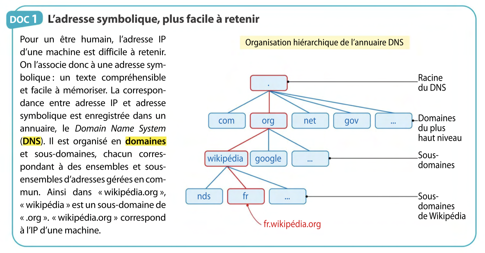
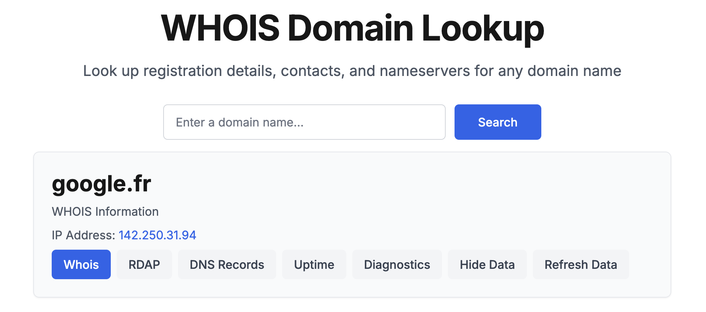
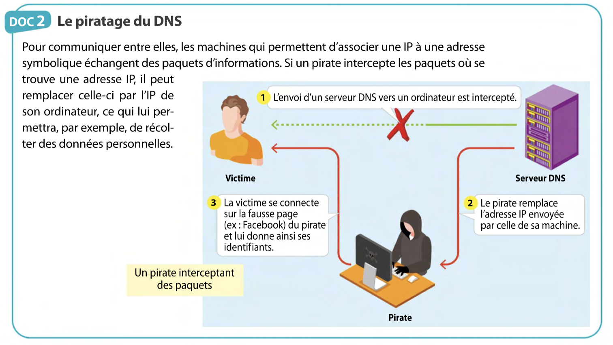
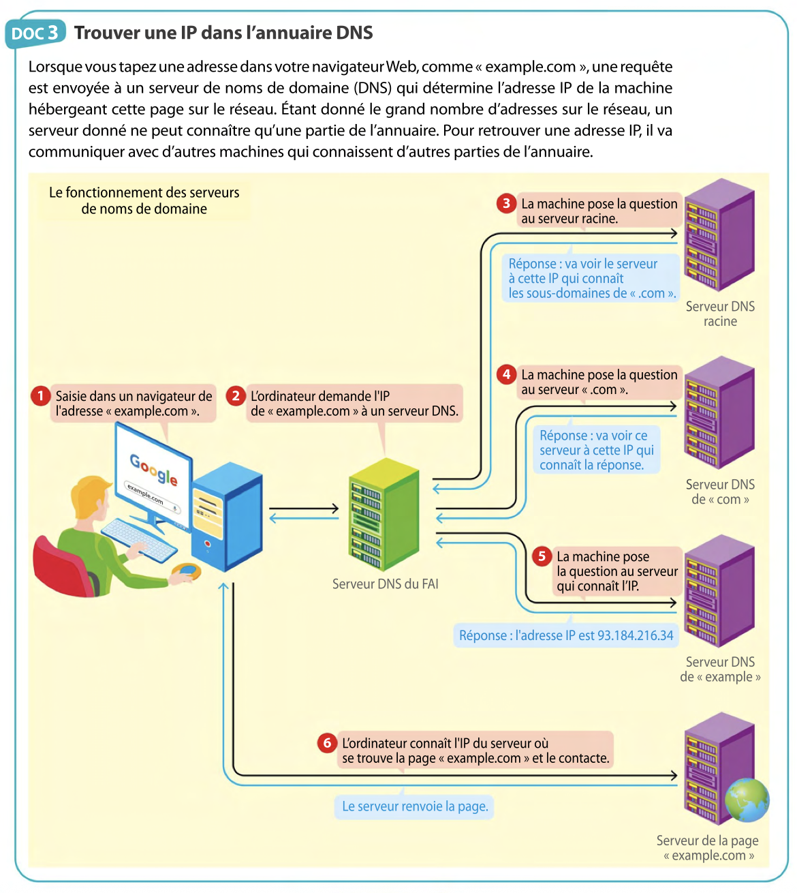

!!! quote "Source"
    Activité et images tirées du manuel ***Sciences numériques et Technologie (SNT) 2de (Ed. 2023)***.

# L'annuaire DNS

Lorsque l'on tente d'accéder à un **site web**, il faut connaître l'**adresse IP** du serveur du site auquel on tente d'accéder. Une adresse IP étant de la forme `182.125.12.172`, il serait difficile de retenir l'adresse de tous les sites que nous visitons.

C'est pourquoi, il existe des **annuaires** permettant d'associer à chaque **adresse IP** de serveur une **adresse** dite **symbolique**.  
Par exemple, `www.google.fr` est l'**adresse symbolique** associée à l'IP `142.250.31.94`.  
Si vous saisissez `142.250.31.94` dans votre **barre d'URL**, vous accéderez bien à *Google*.

## Questions

<figure markdown="span">
  
</figure>

!!! note "Question 1 *(doc 1)*"
    À quel **domaine** appartient l'adresse `snt.erwandemerville.fr` ?  
    Comment connaître l'adresse IP correspondante ?

Si l'on souhaite connaître l'**adresse IP** associée à une **adresse symbolique**, on peut utiliser des services en ligne comme [WHOIS](https://who.is/).

<figure markdown="span">
  
</figure>

!!! note "Question 2"
    En utilisant le service en ligne [WHOIS](https://who.is/), trouvez l'**adresse IP** du site `www.erwandemerville.fr`.

<figure markdown="span">
  
</figure>

<figure markdown="span">
  
</figure>

!!! note "Question 3 *(docs 2 et 3)*"
    À quelles étapes du **document 3** un pirate peuvent-ils intercepter des paquets ?

!!! note "Question 4 *(doc 3)*"
    Pourquoi peut-on dire qu'il faut une collaboration des serveurs de nom de domaine pour retrouver une adresse IP ?

!!! note "Question 5"
    Pour conclure, rédigez un résumé des principales étapes qui vous permettent de consulter `snt.erwandemerville.fr` lorsque vous saisissez son adresse symbolique dans votre navigateur.