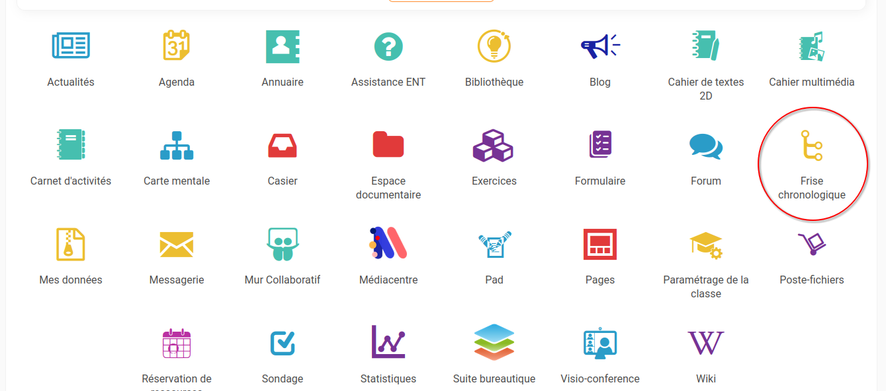
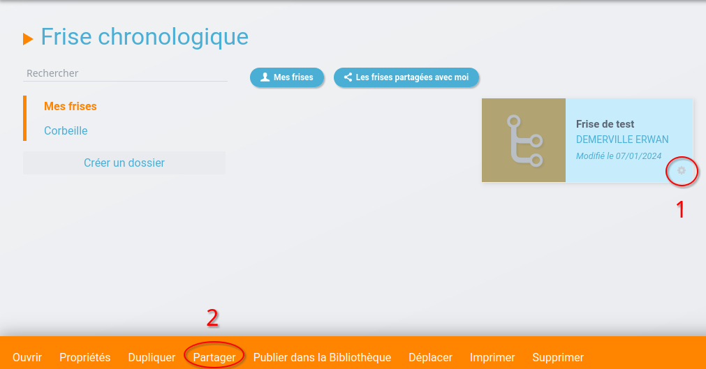
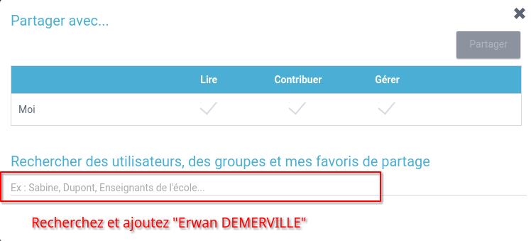

# Activité - Histoire d'internet

## Présentation de l'activité

En **binômes** ou **seuls**, vous allez réaliser une **frise chronologique** retraçant l'**histoire d'internet**.

!!! warning ""
    Quelques élèves, volontaires ou tirés au sort, viendront présenter leur frise chronologique devant la classe. Les élèves qui viendront présenter leur travail verront leur **note de participation augmenter**.

!!! note "À faire - Ouverture de l'application de frises chronologiques"
    Rendez-vous sur la [liste des applications de votre ENT](https://enthdf.fr/welcome){ target="_blank" }.

    Ouvrez l'**application** nommée =="Frise chronologique"== :

    

    Créez une **nouvelle frise** nommée =="L'histoire d'internet - <vos noms>"== en cliquant sur le bouton ++"Créer une frise"++.

    Vous pouvez déjà **partager votre frise avec moi**, afin que je puisse jeter un œil à votre travail :

    

    

## Travail à faire

!!! note "À faire"
    Créez une **frise chronologique** contenant les **évènements suivants** :

    - Visionnez [:octicons-video-16: cette vidéo](https://www.youtube-nocookie.com/embed/dFmTbZMGRdQ){ target="_blank" }, puis placez les évènements suivants dans votre frise :
        - Création d'**ARPA** (devenu **DARPA**),
        - **ArpaNet** (premier réseau internet **américain**),
        - Développement d'un **système de courriel** (email) par Ray Tomlinson,
        - Protocole **TCP / IP** (qui va permettre de former **internet**),
        - Création du *World Wide Web* par Tim Berners-Lee.
    - En vous basant sur vos **propres recherches sur le web** (par exemple sur [Google](https://google.fr/){ target="_blank" }), ajoutez à votre **frise** les **évènements suivants** (les évènements ne sont pas ici présentés dans l'ordre chronologique) :
        - Lancement du satellite **Spoutnik**,
        - Arrivée de l'**ADSL**,
        - Naissance de **Google**,
        - Arrivée de l'**iPhone**,
        - Arrivée de la **fibre optique**,
        - Ouverture du réseau **Transpac** / Création du **Minitel**,
        - Arrivée de la **3G**,
        - Arrivée de la **4G**,
        - Arrivée du **Wi-Fi**,
        - Invention du **datagramme** (liée au projet **Cyclades**, réseau français concurrent de **ArpaNet**),
        - **Démocratisation d'internet**,
        - Arrivée de l'**internet des objets**.
    - Voici quelques **éléments facultatifs** que vous pouvez ajouter à votre frise s'il vous reste du temps :
        - Naissance d'**Android**,
        - Naissance de **Facebook**,
        - Arrivée du langage de programmation **PHP**,
        - Arrivée du langage de programmation **JavaScript**
        - Arrivée de la **5G**,
        - Vous pouvez ajouter tout autre évènement qui vous semble important et lié à l'histoire d'internet.

    Chaque événement devra être accompagné d'un **commentaire expliquant l'évènement ou la technologie en question** (par exemple pour **ArpaNet**, expliquer le principe de son fonctionnement) et, si possible, d'une **image**.