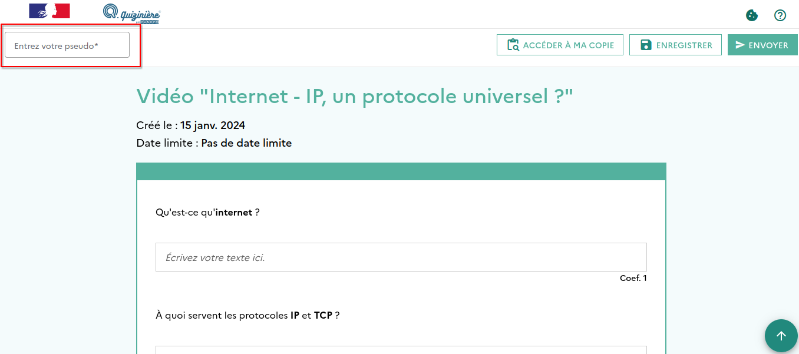

# Activité - Supports machines et adressage IP

## Protocoles et adressage IP

Visionnez la **vidéo suivante** :

<iframe width="560" height="315" src="https://www.youtube-nocookie.com/embed/aX3z3JoVEdE" title="YouTube video player" frameborder="0" allow="accelerometer; autoplay; clipboard-write; encrypted-media; gyroscope; picture-in-picture; web-share" allowfullscreen></iframe>

!!! note "À faire - Questions relatives à la vidéo"
    Cliquez sur le **lien ci-dessous** pour accéder à la **fiche de questions** auxquels vous pourrez directement répondre :

    

    [:material-cursor-default-click: Accéder à la fiche de questions](https://www.quiziniere.com/diffusions/MOL7W8){ target="_blank" }
    

    
    Dans la **case de pseudo** en haut à gauche, vous indiquerez la **première lettre de votre prénom** suivie des **trois premières lettres de votre nom**. (Par exemple, pour "Erwan DEMERVILLE", le pseudo serait "EDEM").

    

    
## Étude de documents - Les réseaux informatiques

!!! note "À faire"
    **Lisez les documents** et **répondez aux questions** de l'activité suivante (issue du manuel de *SNT 2de* de *Delagrave*) :

    

    [:material-cursor-default-click: Accéder à l'activité](https://www.libmanuels.fr/demo/9782206103563/specimen/38/?title=Sciences%20num){ target="_blank" }
    

    Vous **répondrez aux questions** via la **fiche de réponse suivante** :

    

    [:material-cursor-default-click: Accéder à la fiche réponse](https://www.quiziniere.com/diffusions/KOMXQM){ target="_blank" }
    
