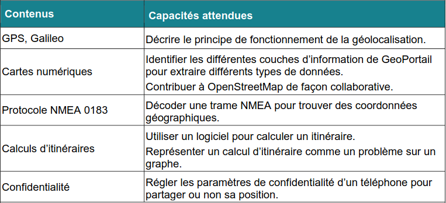

# Localisation, cartographie et mobilité

| Liste des contenus                              | Description                         |
| ----------------------------------------------- | ----------------------------------- |
| [Cours](cours.md) | Cours sur localisation, cartographie et mobilité. |
| [:octicons-link-external-16: Activité - Plateformes de cartographie](src/activite3_plateformes.pdf) | *Analyse de documents* sur les plateformes de cartographie |
| [:octicons-link-external-16: Activité - Trames NMEA](src/activite4_NMEA.pdf) | *Analyse de documents* sur les trames NMEA. |