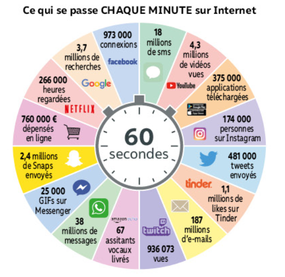

# Introduction aux réseaux sociaux

Les réseaux sociaux, c'est **2,8 milliards** d'utilisateurs actifs mensuels dans le monde !

Notre époque est marquée par le développement planétaire des **réseaux sociaux**. Il s'agit d'applications basées sur les **technologies du Web** qui permettent un service de **mise en relation d’internautes**, ce qui permet de développer des **communautés d’intérêts**. On parle alors de **réseautage social**. Ces réseaux fonctionnent par un système d’**abonnement** à des **relations**/des **amis** et mettent en avant de l’information en fonction du réseau ainsi constitué.

Les réseaux sociaux utilisent **d’importantes bases de données** qui gèrent les comptes utilisateurs, l’ensemble des données qu’ils partagent, mais également toutes celles qu’ils consentent à fournir (sans toujours le savoir), **y compris sur leur vie personnelle**.

De **puissants algorithmes** opèrent sur ces bases de données des réseaux sociaux. Des **algorithmes de recommandation** permettent notamment aux réseaux sociaux de suggérer aux utilisateurs des **amis**, des **contenus**, des **annonces promotionnelles**... Ils permettent aussi à ces plateformes d’étudier les **comportements des utilisateurs**, notamment à des **fins commerciales**, **politiques** ou d’**amélioration du service**.

Ainsi, note vie est **conditionnée** par l'utilisation de **réseaux sociaux**. Bien sûr, l'apport des réseaux est considérable dans notre quotidien, mais des **dangers** sont également présents (on parlera par la suite de la notion de **cyber-harcèlement**).

---

Les réseaux sociaux, c'est **2,8 milliards d'utilisateurs actifs mensuels** dans le monde !

<figure markdown>
  { width="400" }
  <figcaption>Les réseaux sociaux en chiffre <u>Source</u> : Nathan SNT 2de</figcaption>
</figure>

!!! question "Questions préliminaires"
    À votre avis, quels types de données sont échangées sur les réseaus sociaux ?  
    Pourquoi ces réseaux sont-ils qualifiés de "sociaux" ?

## Un petit QCM

Voici un petit QCM d'introduction pour tester vos connaissances préalables.

!!! note "QCM (issu du *Delagrave - SNT 2de*)"
    1. **L'*e-réputation* désigne** :

          1. l'ensemble des dangers d'Internet.
          2. l'image de quelqu'un sur Internet et sur les réseaux sociaux.
          3. l'historique de navigation.

    2. **Un *follower* est une personne qui** :
   
          1. envoie des messages privés.
          2. est populaire.
          3. suit votre compte sur un réseau social.

    3. **Un *hashtag* précède toujours**

          1. le nom de la personne qui vient de publier.
          2. un mot-clé facilitant les recherches.
          3. la date de publication.

    4. **Pour s'inscrire seul sur un réseau social, il faut avoir au moins** :

          1. 15 ans.
          2. 13 ans.
          3. 11 ans.

    5. **Pour éviter que tout le monde ait accès à mes publications, il faut** :

          1. avoir peu d'amis.
          2. les effacer au bout d'une heure.
          3. régler les paramètres de confidentialité.

    6. **Pour choisir un avatar** :

          1. je peux mettre une image de mon choix.
          2. je dois choisir une photo où on me reconnaît.
          3. je dois mettre ma signature.

    7. **Mes publications sur un réseau social sont** :
   
          1. toujours visibles par tout le monde.
          2. toujours visibles uniquement par mes amis.
          3. visibles ou non, cela dépend des réglages.

    8. **Un *troll* est** :

          1. une personne très drôle sur les réseaux sociaux.
          2. quelqu'un qui ne comprend rien aux nouvelles technologies.
          3. une personne qui cherche la polémique.

    9. **Quelqu'un peut perde son emploi pour des éléments qu'il a publiés sur les réseaux sociaux ?**

        1. Oui, la loi l'autorise pour des propos injurieux ou diffamatoires.
        2. Non, c'est de l'ordre de la vie privée.
        3. C'est déjà arrivé mais c'est illégal.

    10. **Quelqu'un qui écrit un message sur un réseau social** :

        1.  peut dire ce qu'il veut. C'est la liberté d'expression.
        2.  n'a pas le droit de donner son avis politique.
        3.  n'a pas le droit de tenir de propos injurieux, racistes ou sexistes.

    11. **Qu'est-ce que le cyberharcèlement ?**

        1. Un acte de violence isolé sur internet.
        2. Une forme de violence répétée sur internet.
        3. Des publicités sur Internet.

    12. **Comment réagir en cas de cyberharcèlement ?**

        1. On ne peut rien faire.
        2. Aller porter plainte et changer tous ses comptes et numéros de portable.
        3. Diffuser des images compromettantes de ses harceleurs.

## Historique

Voici une petite vidéo récapitulative sur l'histoire des réseaux sociaux :

<iframe width="560" height="315" src="https://www.youtube.com/embed/aA_NZdasOg4?si=FXC4fCQhN0fpcOJY" title="YouTube video player" frameborder="0" allow="accelerometer; autoplay; clipboard-write; encrypted-media; gyroscope; picture-in-picture; web-share" allowfullscreen></iframe>

## Caractéristiques des réseaux sociaux

(En construction...)