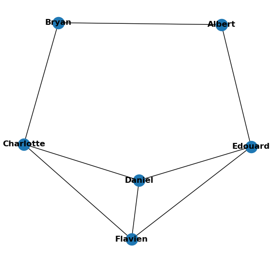
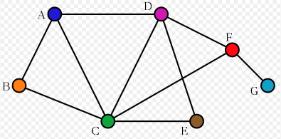
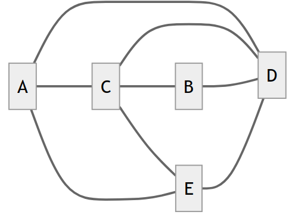
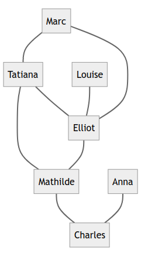

??? quote "Sources"
    - [Pixees](https://pixees.fr/informatiquelycee/n_site/snt_rs_graphe.html){ target="_blank" }
    - [Académie de Nantes - Modéliser un réseau social](https://www.pedagogie.ac-nantes.fr/enseignements-informatiques/enseignement/snt/modeliser-un-reseau-social-simple-1286909.kjsp?RH=1552662845945){ target="_blank" }
    - [Académie de Nantes - Aspects économiques](https://www.pedagogie.ac-nantes.fr/enseignements-informatiques/enseignement/snt/reseaux-sociaux-aspects-economiques-et-controverses-1294359.kjsp){ target="_blank" }
    - [moussatat.github.io](https://moussatat.github.io/snt/reseauxsociauxB){ target="_blank" }

# Activité - Modéliser un réseau social

## Exercices

!!! info "Activité notée"
    Cette activité sera **notée** sur **10 points**. Une autre activité sera réalisée plus tard pour obtenir une note sur **20 points**. Répondez aux questions ci-dessous **sur une feuille** que vous me rendrez. N'oubliez pas de mettre votre nom, votre prénom et votre classe !

Voici un graphe illustrant un réseau social ayant 6 abonnés (A, B, C, D, E et F) tel que :

- A est ami avec B, C et D
- B est ami avec A et D
- C est ami avec A, E et D
- D est ami avec tous les autres abonnés
- E est ami avec C, D et F
- F est ami avec E et D

Les cercles sont appelés des **sommets** et les segments de droites des **arêtes**.

<figure markdown>
  { width="80%" }
  <figcaption>Modélisation d'un réseau social</figcaption>
</figure>

!!! abstract "Vocabulaire"
    **<u>Chaîne</u>** : Dans un graphe, une **chaîne** reliant un sommet **x** à un sommet **y** est définie par une **suite finie d'arêtes consécutives**, reliant **x** à **y**.  
    Exemple : Dans le graphe donné ci-dessus, A-D-E-C est une chaîne de 3 arêtes

    **<u>Distance entre 2 sommets</u>** : La distance entre deux sommets d'un graphe est le **nombre minimum d'arêtes** d'une **chaîne** allant de **l'un à l'autre**.  
    Exemple : La distance entre le sommet A et le sommet F est de 2 (chaîne A-D-F).

    **<u>Écartement</u>** : L'**écartement** d'un sommet est la **distance maximale** existant entre **ce sommet** et **les autres sommets** du graphe.  
    Exemple : distance (A-B) = 1 ; distance (A-C) = 1 ; distance (A-D) = 1 ; distance (A-E) = 2 ; distance (A-F) = 2 ; nous pouvons donc dire que la distance maximale existant entre le sommet A et les autres sommets du graphe est de 2 (distance (A-E) et distance (A-F)). Nous pouvons donc dire que l'écartement de A est de 2.

    **<u>Centre</u>** : On appelle **centre d'un graphe**, le **sommet d'écartement minimal** (le centre n'est pas nécessairement unique).  
    Exemple : Dans le graphe 1 tous les sommets ont un écartement de 2 à l'exception du sommet D qui a un écartement de 1, nous pouvons donc affirmer que le centre du graphe 1 est le sommet D.

    **<u>Rayon</u>** : On appelle **rayon** d'un **graphe G**, l'**écartement** d'un **centre de G**.  
    Exemple : D a un écartement de 1, c'est le centre du graphe, nous pouvons donc dire que le rayon du graphe est de 1.

    **<u>Diamètre</u>** : On appelle **diamètre** d'un **graphe G**, la **distance maximale** entre **deux sommets** du **graphe G**.  
    Exemple : Dans le graphe 1 la distance maximale entre 2 sommets est de 2, nous pouvons donc dire que le diamètre du graphe est de 2.

!!! note "Exercice 1"
    1. En utilisant le graphe présenté précédemment, répondre aux consignes suivantes :
          1. Donner une **chaine** de ce graphe composée de **4 arêtes** et une **chaine** de **5 arêtes**.
          2. Déterminer la **distance** entre le sommet **C** et **B** et la **distance** entre le sommet **B** et **E**.
          3. Déterminer **l’écartement** de **D** ainsi que **l’écartement** de **E**.

??? tip "Réponse exercice 1"
    1. Chaîne de **4 arêtes** : *B-A-D-F-E*, ou encore *B-A-C-E-F*...  
    Chaîne de **5 arêtes** : *F-E-C-A-B-D*, ou encore *B-D-F-E-C-A*...

    2. La **distance** entre **C** et **B** est de **2 arêtes** (c'est le plus petit nombre d'arêtes qui les sépare), et la **distance** entre **B** et **E** est également de **2 arêtes**.
   
    3. L'**écartement** de **D** est de **1** (car sa distance avec tous les autres sommets est de **1**), et l'écartement de **E** est de **2**.

!!! note "Exercice 2"
    Construire un **graphe** d’un **réseau social** à partir des informations suivantes :
    
    - Albert est ami avec Bryan et Edouard
    - Bryan est ami avec Albert et Charlotte
    - Charlotte est ami avec Bryan, Flavien et Daniel
    - Daniel est ami avec Charlotte, Flavien et Edouard
    - Edouard est ami avec Albert, Daniel et Flavien
    - Flavien est ami avec Charlotte, Daniel et Edouard

    (Vous pouvez utiliser des **lettres** de **A** à **F** si vous préférez.)

??? tip "Réponse exercice 2"
    Voici le graphe obtenu (on peut le représenter différemment, tant qu'il contient les mêmes sommets et les mêmes arêtes) :

    { width="300" }

    Ce graphe contient :

    - **6 sommets**
    - **8 arêtes**
    - **Centres** du graphe : 'Albert', 'Bryan', 'Edouard', 'Charlotte', 'Flavien' et  'Daniel' sont **tous des centres**, car ils ont **tous le même écartement** (qui est de *2*).
    - **Diamètre** du graphe : **2** (car la **distance maximale** entre deux **sommets** est de **2**)

!!! note "Exercice 3"
    Déterminer **le** (ou **les**) **centre(s)** du **graphe ci-dessous**.  
    En déduire son **rayon** et son **diamètre**.

    

??? tip "Réponse exercice 3"
    <u>**Centres du graphe**</u>

    Pour déterminer le **centre du graphe**, regardons d'abord l'**écartement de chaque sommet** :

    - **A** a un écartement de *3*,
    - **B** a un écartement de *3*,
    - **C** a un écartement de *2*,
    - **D** a un écartement de *2*,
    - **E** a un écartement de *3*,
    - **F** a un écartement de *2*,
    - **G** a un écartement de *3*.

    Les **centres du graphe** sont les **sommets d'écartement minimal**. Ici, les **trois sommets** ayant l'**écartement le plus petit** (qui est de *2*) sont : *C*, *D* et **F**.

    <u>**Rayon**</u> :

    Le **rayon** est l'**écartement d'un centre du graphe**.  
    Les **centres** de ce graphe ont pour écartement **2**, donc le **rayon** est de **2**.

    <u>**Diamètre**</u> :

    Le **diamètre** est la **distance maximale** entre **deux sommets** du graphe. Ici, les sommets les plus éloignés entre eux ont une **distance** de **3**, donc le diamètre est de **3**.

---

Un **tableau d'adjacence** est un **tableau à double entrée** où chaque case contient **1** si les sommets sont **liés par une arête**, et **0** sinon.

<u>**Exemple**</u> :

<figure markdown>
  { width="60%" }
</figure>

| Adjacence | A    | B    | C    | D    | E    |
| --------- | ---- | ---- | ---- | ---- | ---- |
| A         | 0    | 0    | 1    | 1    | 1    |
| B         | 0    | 0    | 1    | 1    | 0    |
| C         | 1    | 1    | 0    | 1    | 1    |
| D         | 1    | 1    | 1    | 0    | 1    |
| E         | 1    | 0    | 1    | 1    | 0    |

!!! note "Exercice 4"
    Voici un graphe :

    { width="30%" }

    a. Combien y a t-il d'**arêtes** et de **sommets** dans ce **graphe** ?  
    b. Complétez le tableau d'adjacence de ce graphe :

    | <u>Adjacence</u> | Anna | Charles | Elliot | Louise | Mathilde | Marc | Tatiana |
    | ---------------- | ---- | ------- | ------ | ------ | -------- | ---- | ------- |
    | **Anna**         |      |         |        |        |          |      |         |
    | **Charles**      |      |         |        |        |          |      |         |
    | **Elliot**       |      |         |        |        |          |      |         |
    | **Louise**       |      |         |        |        |          |      |         |
    | **Mathilde**     |      |         |        |        |          |      |         |
    | **Marc**         |      |         |        |        |          |      |         |
    | **Tatiana**      |      |         |        |        |          |      |         |

    c. Déterminer le **diamètre** et **le(s) centre(s)** du **graphe**.

??? tip "Réponse exercice 4"
    a. Il y a **8 arêtes** et **7 sommets** dans ce graphe.

    b. Voici le **tableau d'adjacence** obtenu :
    
    | <u>Adjacence</u> | Anna | Charles | Elliot | Louise | Mathilde | Marc | Tatiana |
    | ---------------- | ---- | ------- | ------ | ------ | -------- | ---- | ------- |
    | **Anna**         |   0  |    1    |    0   |   0    |     0    |  0   |    0    |
    | **Charles**      |   1  |    0    |    0   |   0    |     1    |  0   |    0    |
    | **Elliot**       |   0  |    0    |    0   |   1    |     1    |  1   |    1    |
    | **Louise**       |   0  |    0    |    1   |   0    |     0    |  0   |    0    |
    | **Mathilde**     |   0  |    1    |    1   |   0    |     0    |  0   |    1    |
    | **Marc**         |   0  |    0    |    1   |   0    |     0    |  0   |    1    |
    | **Tatiana**      |   0  |    0    |    1   |   0    |     1    |  1   |    0    |

    c. La **distance maximale** entre **2 sommets** est de **4 arêtes** : Donc le **diamètre** est de **4**.
---

Visionnez les **12 premières minutes** de la vidéo suivante :

<iframe width="560" height="315" src="https://www.youtube.com/embed/UX7YQ6m2r_o?si=guf7l6LRxA4yEOqH" title="YouTube video player" frameborder="0" allow="accelerometer; autoplay; clipboard-write; encrypted-media; gyroscope; picture-in-picture; web-share" allowfullscreen></iframe>

!!! note "Exercice 5 - *Questions sur la vidéo*"
    1. Décrire le **premier modèle théorique** introduit par **Paul Erdös** pour simuler un réseau social.  
    Quelle est la **première propriété** mise en évidence par ce modèle ?
    2. En vous aidant de la page wikipedia, décrire l'[expérience de Stanley Milgram](https://fr.wikipedia.org/wiki/%C3%89tude_du_petit_monde){ target="_blank" } du « petit monde ».
    3. Quelle(s) **critique(s) majeure(s)** peux-on émettre sur l'étude menée ?
    4. Quel est le **réseau social étudié** par **Duncan Watts** ? Quelle est la **longueur moyenne** du **chemin** entre deux acteurs ?
    5. Quel **effet** a **l’utilisation des plateformes de réseaux sociaux** sur les **degrés de séparation** ?
    6. Quelle **seconde propriété des réseaux sociaux** a été identifiée par **Duncan Watts** ?
    7. **Albert Lazlo Barabasi** constate que les réseaux sociaux font aussi apparaitre des **Hubs** (également appelés *clusters*) faisant le **lien entre différentes sous-communautés** :

        1. Donner **d'autres exemples de réseaux** qui exhibent cette propriété.
        2. Quelle est la **justification** proposée par **Barabasi** d'une telle organisation ?
    8. Donner les **caractéristiques** identifiés par l'auteur pour le réseau social formé des **amateurs de sciences** sur **Twitter** (la valeur du **degré de séparation**, quelques **sous-communautés** et des **hubs**).
    9. D'après vous, quels peuvent être les **conséquences** de ces **regroupements** sur les réseaux sociaux ?

??? tip "Réponse exercice 5"
    1. Le **premier modèle théorique** introduit par *Paul Erdős* pour simuler un réseau social est un modèle de **graphes aléatoires**. Ce modèle suppose que chaque **paire d'individus** dans un réseau social a une **probabilité fixe et indépendante** de former une connexion.  
    La **première propriété* mise en évidence est celle des **6 degrés de séparation** : il s'agit de l'idée selon laquelle **chaque individu sur le globe** est relié à **tout autre individu** par une chaîne de relations individuelles comprenant **au plus cinq autres maillons**.

    2. L'expérience du "petit monde" de Stanley Milgram a été menée en *1967*. Dans cette expérience, Milgram a demandé à des participants de *Omaha* au *Nebraska* d'envoyer des lettres à des personnes situées à *Boston*, en utilisant uniquement des **connaissances personnelles** et des **contacts intermédiaires**. L'objectif était de voir **combien d'étapes intermédiaires** étaient nécessaires pour que la lettre atteigne la personne cible.

    3. Les **critiques majeures** de cette étude sont les suivantes :

          1. Le nombre de lettres qui ont effectivement atteint la cible était assez faible, remettant en question la validité de l'expérience.

          2. Les expériences conduites sur de **larges populations** plutôt que sur des groupes restreints et habitués à collaborer ont apporté un taux de succès si faible que les résultats n'ont pas été publiés.

    4. *Duncan Watts* a étudié le réseau social des **acteurs hollywoodiens**. Il a découvert que la longueur moyenne du chemin entre deux acteurs était beaucoup plus courte que prévu, d'environ **3,6 personnes** (donc **3,6 arêtes**), montrant ainsi la notion de "petit monde" dans ce réseau.

    5. L'utilisation des plateformes de **réseaux sociaux** a réduit le **nombre de degrés de séparation**. Elle serait d'environ **4 intermédiaires**, voire **3** si les individus résident dans le même pays.

    6. La **seconde propriété** des réseaux sociaux identifiée par *Duncan Watts* est la présence de **regroupements d'individus d'une même communauté**. Il existe beaucoup de liens au sein d'une même communauté, mais beaucoup moins entre les différentes communautés.
   
    7. 
          1. On peut citer comme exemples d'autres réseaux :
                - le réseau de la **musique** : une personne faisant partie d'une communauté de **jazz** par exemple connaît toutes les autres personnes de sa commuanuté, mais peut également connaître celles de la communauté du **rock** par exemple, et ainsi faire le lien entre plusieurs communautés (ce qui en ferait un **hub**).
                - les **réseaux de transport aérien**, où certains aéroports majeurs servent de **hubs** reliant différentes régions du monde.
                - les **réseaux de citation académique**, avec des articles influents servant de hubs reliant différentes sous-disciplines.
          2. La justification d'une telle organisation par Barbasi est qu'un grand nombre de personnes possède peu d'amis mais q'un nombre plus réduit de personnes possède beaucoup d'amis.

    8. Selon *Albert-László Barabási*, le réseau social formé par les amateurs de sciences sur Twitter a les caractéristiques suivantes :

          1. La valeur du **degré de séparation** est généralement courte (**3,5 degrés** entre **chaque individu** en moyenne), ce qui signifie que les utilisateurs sont relativement proches les uns des autres en termes de connexions.
          2. Il existe plusieurs **sous-communautés** d'amateurs de sciences sur Twitter, chacune ayant ses propres centres d'intérêt et discussions : les sceptiques, les chercheurs, les institutions culturelles scientifiques...
          3. Des **hubs** influents existent, comme des scientifiques bien connus ou des personnalités de la science, qui jouent un rôle clé dans la diffusion d'informations au sein du réseau.

    9.  Les **regroupements** au sein des **réseaux sociaux** peuvent avoir plusieurs conséquences :

           - Ils favorisent la diffusion rapide d'informations au sein des sous-communautés.
           - Ils peuvent renforcer l'**homogénéité des opinions et des croyances** au sein de ces sous-communautés, ce qui peut conduire à des **bulles d'information**.
           - Ils peuvent contribuer à l'*echo chamber* en limitant l'exposition à des **perspectives différentes**, ce qui peut être préjudiciable pour la **prise de décision éclairée**.

---

## Aller plus loin avec Python

(Cette partie ne compte pas dans les exercices notés.)

!!! success "À télécharger"
    Télécharger le fichier suivant : [graphe.py](src/graphes.py){ target="_blank" }

!!! note "À faire 1"
    1. Ouvrir l'application **Thonny**
    2. Cliquer sur l'onglet `Fichier` puis `Ouvrir`.
    3. Choisissez votre fichier `graphe.py` préalablement téléchargé.
    4. Vous devez installer le **module Python** nommé ***networkx*** et le module nommé ***matplotlib***. Pour cela, cliquez sur l'onglet `Outils`, puis `Gérer les paquets`, puis **recherchez** et **installez** les deux modules.
    { width="500" }
    5. Exécutez le script avec le bouton d'exécution (le bouton vert avec une flèche), ou en appuyant sur le bouton `F5` du clavier. **Observez ce qu'il se passe**.

    N'hésitez pas à jeter un oeil à [cette présentation de Thonny](https://nsi.erwandemerville.fr/premiere/bases_python/thonny/){ target="_blank" } pour en savoir plus sur son fonctionnement.

!!! note "À faire 2"
    Tentez de **modifier** le code pour **afficher** le graphe suivant :

    { width="30%" }

    Vérifiez si **le(s) centre(s)** du **graphe** et son **diamètre affichés** par le programme (dans la **console** en bas à gauche) correspondent bien à ceux obtenus à l'*exercice 4*.

!!! note "À faire 3"
    **Modifiez** le programme de manière à obtenir le graphe suivant :

    { width="50%" }

    Quels sont **le(s) centre(s)** du **graphe** et son **diamètre affichés** par le programme ?