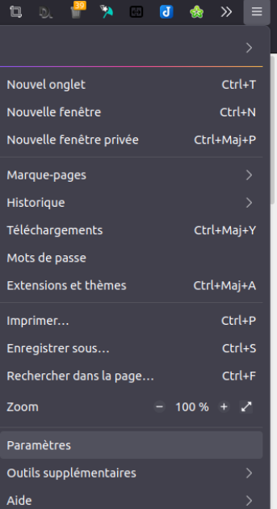
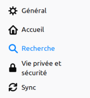
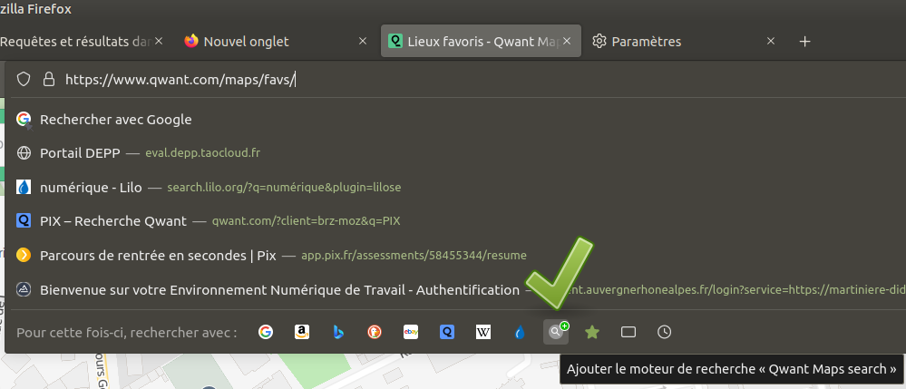
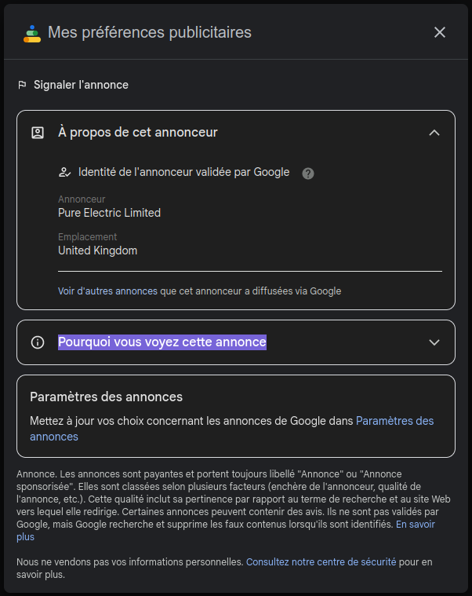
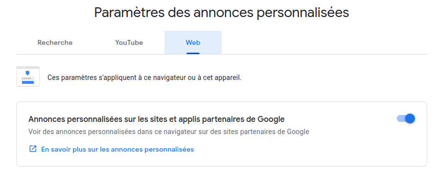

??? quote "Source"
    Cette activité est basée sur celle-ci :

    - [http://portail.lyc-la-martiniere-diderot.ac-lyon.fr/srv20/co/AA2_-_Moteur_de_recherche.html](http://portail.lyc-la-martiniere-diderot.ac-lyon.fr/srv20/co/AA2_-_Moteur_de_recherche.html){ target="_blank" }

# Activité - Les moteurs de recherche

## Introduction

!!! abstract ""
    Il existe actuellement environ **deux milliards de sites web** et des **dizaines de milliards de pages web**. Pour **chercher une information** particulière dans cette "toile d'araignée" géante (toile = *web* en anglais) que constitue le web, des **applications Web** appelés **moteurs de recherche**, qui s'exécutent dans un **navigateur**, sont nécessaires.

    Un **moteur de recherche** est un **service web**, que l'on lance à l'aide d'un **navigateur web**.

!!! success ""
    Parmi les appelés **moteurs de recherche** les plus répandus, on retrouve :

    - **Mozilla Firefox**, le plus respectueux de votre vie privée, il est open-source et libre,

    - **Google Chrome**, le navigateur de Google présent par défaut sur Android et qui envoie de nombreuses informations personnelles aux serveurs de Google,

    - **Microsoft Edge** (anciennement Internet Explorer) présent par défaut sur Windows© ; il collecte par défaut les données de vos recherches (source),

    - **Safari**, le navigateur présent sur les appareils Apple,

    - **Opera**, **Brave**, **Vivaldi**... moins connus que les précédents mais qui ont chacun leurs spécificités.

    |    |    |    |    |    |    |
    | ---- | ---- | ---- | ---- | ---- | ---- |

!!! note "Travail à faire"
    Les réponses à l'activité seront à compléter sur le **document LibreOffice Writer** suivant :

    

    [:material-cursor-default-click: Télécharger le document à compléter](documents/document_reponse_moteurs_recherche.odt){ target="_blank" }
    

    Le nom du **fichier LibreOffice** devra être de la forme : `<Nom>_<Prenom>_MoteurRecherche.odt`

    Le fichier devra être **rendu via mon site**, via la page [rendu des travaux](../rendus.md){ target="_blank" }.

    ==Vous pouvez travailler en **binômes**, auquel cas vous rendez **un seul document avec vos deux noms**.==

---

## Fonctionnement des moteurs de recherche

<iframe width="560" height="315" src="https://www.youtube-nocookie.com/embed/iKMm6SXO0wA" title="YouTube video player" frameborder="0" allow="accelerometer; autoplay; clipboard-write; encrypted-media; gyroscope; picture-in-picture; web-share" allowfullscreen></iframe>

**Visionnez la vidéo**, et **répondez** à la **question suivante** :

!!! note "Question 1"
    Compléter les 3 cases du tableau suivant qui décrit le fonctionnement général d'un moteur de recherche ? Ne pas oublier le terme anglais sur le ligne 1 du tableau.

    <table style="border-collapse: collapse; width: 100%; border: 1px solid black;">
        <colgroup>
            <col style="width:224px;width:28.39ch;">
            <col style="width:224px;width:28.39ch;">
            <col style="width:224px;width:28.39ch;">
        </colgroup>
        <tbody>
            <tr style="background-color: #f2f2f2; border-bottom: 1px solid black;">
                <th scope="col" style="border: 1px solid black;">
                    
Tâches

                </th>
                <th scope="col" style="border: 1px solid black;">
                    
Explication

                </th>
                <th scope="col" style="border: 1px solid black;">
                    
Terme anglais

                </th>
            </tr>
            <tr>
                <td style="border:1px solid black;" style="border: 1px solid black;">(à compléter)</td>
                <td style="border:1px solid black;" style="border: 1px solid black;">
                    
Des robots explorent le web en suivant les liens entre pages

                </td>
                <td style="border:1px solid black;" style="border: 1px solid black;">(à compléter)</td>
            </tr>
            <tr>
                <td style="border:1px solid black;" style="border: 1px solid black;">(à compléter)</td>
                <td style="border:1px solid black;" style="border: 1px solid black;">
                    
Analyse des pages en ajoutant des mots-clés et en stockant ces données sur des serveurs

                </td>
                <td style="border:1px solid black;" rowspan="6" style="border: 1px solid black;">
X
</td>
            </tr>
            <tr>
                <td style="border:1px solid black;" style="border: 1px solid black;" rowspan="5">
Analyse et renvoi des résultats à l'internaute
</td>
                <td style="border:1px solid black;">
L'internaute tape sa requête dans le moteur de recherche
</td>
            </tr>
            <tr>
                <td style="border:1px solid black;">
La requête est envoyée au serveur de stockage
</td>
            </tr>
            <tr>
                <td style="border:1px solid black;">
Les mots-clés sont comparés aux listes établies
</td>
            </tr>
            <tr>
                <td style="border:1px solid black;">
La pertinence de la page est analysée selon des algorithmes
</td>
            </tr>
            <tr>
                <td style="border:1px solid black;">
Les pages sont proposées à l'internaute, triées par qualité et pertinence
</td>
            </tr>
        </tbody>
    </table>

## Utiliser les moteurs de recherche dans le navigateur Firefox

On compte de **nombreux moteurs de recherche disponibles** et certains sont disponibles **nativement** dans les navigateurs comme **Mozilla Firefox**.

Ces manipulations sont à réaliser sur **Firefox** mais sont **quasi identiques** sur d'autres navigateurs web.

Voyons cela dans le détail.

### Moteur de recherche par défaut

!!! note "Manipulation à faire"
    **Ouvrir** le **menu d'options** de **Firefox** en cliquant sur l'icône rayée :material-menu: en **haut à droite** de la **barre de menu**, puis sélectionner **Paramètres** dans le menu déroulant :

    

    { width="300px" }
    

    Puis, sélectionner le menu Recherche dans le menu de gauche :

    <figure markdown>
    

    { width="150" }
    

    <figcaption>Menu gauche dans les préférences de Firefox</figcaption>
    </figure>
    
    **Changer** le **moteur de recherche par défaut** en sélectionnant une des propositions de la liste déroulante (*DuckDuckGo* ou *Qwant* sont de bonnes alternatives). **Tester le bon fonctionnement** en utilisant le **champ** où l'on **tape des adresses web ou URL**.

### Ajouter un moteur de recherche dans un navigateur web

!!! note "Manipulations à faire"

    Dans tous les **navigateurs**, il est aisé d'**ajouter un moteur à cette liste**. On peut utiliser **3 moyens** :

    1. Lancer le site [Qwant Maps](https://www.qwant.com/maps/){ target="_blank" }, et **cliquer sur le champ de la barre de recherche** (Cf. image ci-dessous) puis *Ajouter ce moteur de recherche* ; constater par la suite la bonne réussite de l'opération en retrouvant ce moteur dans la liste proposée par Firefox. On peut retrouver cette icone d'ajout de moteur à d'autres endroits...
    <figure markdown>
    

    { width="300px" }
    

    <figcaption>[Cliquer ici pour voir l'image en taille réelle](images/ajout_qwant_maps.png){ target="_blank" }</figcaption>
    </figure>
    
    2. Aller sur un nouveau moteur de recherche, par exemple [Lilo](https://www.lilo.org/){ target="_blank" }. Ce site web va vous proposer d'**ajouter ce moteur à votre navigateur**, réaliser l'ajout à votre navigateur en cliquant sur le bouton prévu à cet effet :
    

    
    

    
    3. Utiliser le menu *Paramètres* > *Recherche* et **parcourir la liste des moteurs de recherche** en cliquant sur le lien [Découvrir d’autres moteurs de recherche](https://addons.mozilla.org/fr/firefox/search-engines/){ target="_blank" }.

### Utiliser différents moteurs de recherche dans Firefox

!!! note "Manipulation finale à faire"
    Une fois **les moteurs de recherche installés dans Firefox**, on peut les utiliser de manière simple en suivant cette courte vidéo :

    

    En suivant les explications de la vidéo :

    1. Réaliser une recherche sur *Wikipédia* **sans lancer sa page d'accueil**.

    2. Réaliser une recherche du *Lycée Jean Perrin* dans **Qwant Maps**.

!!! success "À montrer au professeur"
    Après avoir réalisé les manipulations, appelez le professeur et :

    - **montrez** la **liste des moteurs de recherche de votre navigateur**,
    - faites une **recherche** dans *Qwant Maps* (de ce que vous voulez) en utilisant la méthode utilisée précédemment.

## Requêtes et résultats dans les moteurs de recherche

Avec la domination de **Google**, des **moteurs de recherche alternatifs** essaient de se distinguer par le choix d'un **modèle plus respectueux de la vie privée de ses utilisateurs**. On peut citer l'américain *DuckDuckGo* et le français / européen *Qwant*.

### Premier lancement des moteurs de recherche Google et Qwant

Au premier lancement de **Google**, vous devez dire si vous acceptez ou pas l'usage de cookies (nous verrons en détail ce que sont les cookies lors de l'activité suivante).

!!! note "Question 2"
    - Ouvrir une fenêtre de navigation privée (menu contextuel de Firefox ou ++ctrl+"Maj"+p++) puis
    - Aller sur le moteur de recherche Google et réaliser une capture d'écran de cette fenêtre du premier lancement du moteur de recherche Google (la fenêtre comprend 2 boutons `Tout refuser` et `Tout accepter`).
    - Faites un choix :
        - `Tout accepter` autorise Google à analyser votre navigation que vous allez faire sur le domaine Google.com
        - `Tout refuser` n'autorise pas Google à analyser votre navigation, en vertu des règles européennes sur la protection des données personnelles.

!!! note "Question 3"
    Toujours dans la fenêtre privée, ouvrir un nouvel onglet et lancer le moteur de recherche *qwant.com* : [https://www.qwant.com/](https://www.qwant.com/){ target="_blank" }

    Avez-vous du **accepter ou refuser des cookies** ?

### Requête dans 2 moteurs

!!! note "Question 4"
    Soumettre la requête « achat trotinette électrique » (la faute d'orthographe sur *trotinette* est volontaire, comparez la gestion de la correction automatique par les deux moteurs) aux moteurs de recherche Google et Qwant (en désactivant les éventuels bloqueurs de publicité, mais cela ne doit pas être le cas au lycée).

    **Obtenez-vous** les mêmes résultats avec les deux moteurs ?

    Quels sont les 2 premiers sites web hors annonces publicitaires.

!!! note "Question 5"
    Dans les résultats du moteur de recherche Google, on remarque immédiatement une carte.

    - Que recense cette carte ?
    - Comment sait-il que vous vous situez dans ces environs ? Vous pourrez trouver la solution en fouillant le bas de la page...
    - Avons-nous la même chose avec Qwant ?

### Financement des moteurs de recherche

Ce n'est un secret pour personne, financer un moteur de recherche coûte cher. Il faut donc trouver des sources de financement. La seule source de revenus actuellement est la publicité mais il y a de grandes différences entre les moteurs de recherches.

Prenons l'exemple de **Google** et **Qwant**.

!!! note "À faire"
    Avec le moteur de recherche **Google**, **repérez** les **résultats** qui sont des **annonces publicitaires** (par exemple, recherchez `achat trottinette électrique`) et cliquer sur les **trois petits points** situés à côté de l'annonce.

    Dans la **fenêtre modale** qui s'affiche (voir *image ci-dessous*), **développer le menu** `Pourquoi vous voyez cette annonce`...

    <figure markdown>
    

    { width="300px" }
    

    <ficaption>[Cliquez ici pour voir l'image en taille réelle](images/Google_pref_publicites.png){ target="_blank" }</figcaption>
    </figure>

!!! note "Question 6"
    - D'après la notice d'informations qui s'affiche, pourquoi voyez-vous cette annonce ? Est-ce que seuls les termes recherchés permettent à une annonce de s'afficher ?

!!! note "Question 7"
    Il est possible de **personnaliser** ou pas les **annonces** affichées. Personne ne devrait accepter cette personnalisation qui fait de vous un objet publicitaire.

    Toujours dans la fenêtre, en dessous, vous pouvez **mettre à jour vos choix** concernant les **annonces** de Google.

    - Quel est le paramétrage pour ces annonces ? À présent rappelez-vous sur quel bouton bleu vous avez cliqué au lancement de Google et expliquer ce paramétrage...

    <figure markdown>
    

    { width="600px" }
    

    <ficaption>Curseur du choix de la personnalisation des annonces sponsorisées [Cliquez ici pour voir l'image en taille réelle](images/Personnalisation_Annonces_Google.png){ target="_blank" }</figcaption>
    </figure>

!!! note "Question 8"
    **Accéder** à la page d'URL [https://about.qwant.com/fr/legal/confidentialite/](https://about.qwant.com/fr/legal/confidentialite/){ target="_blank" } puis au paragraphe `« Donc Qwant n'affiche pas de publicité ciblée ? »`.

    Quelle est la politique de **Qwant** en matière d'affichage publicitaire ?

### Politique de confidentialité

!!! note "Question 9"
    À l'aide des manipulations précédentes et en parcourant les politiques de confidentialité de [Google](https://policies.google.com/privacy?utm_source=search-privacy-advisor){ target="_blank" } et de [Qwant](https://about.qwant.com/fr/legal/confidentialite/){ target="_blank" }, cochez, sur votre document LibreOffice, le moteur qui répond aux phrases suivantes :

    <table style="border-collapse: collapse; width: 100%; border: 1px solid black;"><colgroup><col style="width:224px;width:28.39ch;"><col style="width:224px;width:28.39ch;"><col style="width:224px;width:28.39ch;"></colgroup><tbody style="border-bottom: 1px solid black;"><tr style="background-color: #f2f2f2;"><th scope="col"></th><th scope="col">
Google
</th><th scope="col">
Qwant
</th></tr><tr><td style="border:1px solid black;" style="border:1px solid black;">
Quel moteur vous propose des résultats basés sur vos précédentes recherches&nbsp;?
</td><td style="border:1px solid black;"></td><td style="border:1px solid black;"></td></tr><tr><td style="border:1px solid black;" style="border:1px solid black;">
Quel moteur dépose des cookies pour tracer votre activité&nbsp;?
</td><td style="border:1px solid black;"></td><td style="border:1px solid black;"></td></tr><tr><td style="border:1px solid black;">
Quel moteur ne conserve aucune donnée sur votre activité sur le web&nbsp;?
</td><td style="border:1px solid black;"></td><td style="border:1px solid black;"></td></tr><tr><td style="border:1px solid black;">
Quel moteur anonymise vos recherches&nbsp;?
</td><td style="border:1px solid black;"></td><td style="border:1px solid black;"></td></tr><tr><td style="border:1px solid black;">
Quel moteur renverra les mêmes résultats que ce soit vous, vos parents ou votre cousin en Afrique&nbsp;?
</td><td style="border:1px solid black;"></td><td style="border:1px solid black;"></td></tr><tr><td style="border:1px solid black;">
Quel moteur n'utilise pas de cookies publicitaires&nbsp;?
</td><td style="border:1px solid black;"></td><td style="border:1px solid black;"></td></tr><tr><td style="border:1px solid black;">
Quel moteur de recherche est français&nbsp;?
</td><td style="border:1px solid black;"></td><td style="border:1px solid black;"></td></tr><tr><td style="border:1px solid black;">
Quel moteur s'engage à ne vendre aucune donnée de ces utilisateurs&nbsp;?
</td><td style="border:1px solid black;"></td><td style="border:1px solid black;"></td></tr><tr><td style="border:1px solid black;">
Quel moteur utilise le bluetooth, adresse IP, GPS ou encore des points d'accès Wifi pour vous géolocaliser&nbsp;?
</td><td style="border:1px solid black;"></td><td style="border:1px solid black;"></td></tr><tr><td style="border:1px solid black;">
Quel moteur justifie la captation des données personnelles pour améliorer ses services&nbsp;?
</td><td style="border:1px solid black;"></td><td style="border:1px solid black;"></td></tr><tr><td style="border:1px solid black;">
Quel moteur stocke ses données <q class="txt_quote_is ">«&nbsp;aux quatre coins du monde&nbsp;»</q>&nbsp;?
</td><td style="border:1px solid black;"></td><td style="border:1px solid black;"></td></tr></tbody></table>

!!! quote "Google ne comprend pas ses propres paramètres de confidentialité ?"
    Pour aller plus loin, vous pouvez lire l'article [Google avoue ne rien comprendre à ses propres paramètres de confidentialité](https://www.lesnumeriques.com/vie-du-net/google-avoue-ne-rien-comprendre-a-ses-parametres-de-confidentialite-n153735.html){ target="_blank" }.

## Devenez un hacker avec le "Google Dorking"

On en a déjà parlé en cours, le moteur de recherche **Google** permet de faire des **recherches avancées** à l'aide d'une **syntaxe** bien précise (constituée de mots-clé comme `intext`, `inurl`, `filetype`, etc.)  
Grâce à **Google Dorks**, on peut donc utiliser **Google** comme un **outil de hack**, on parle donc de "Google Hacking" ou de "Google Dorking". Cette méthode d'investigation sur Internet s'appuie sur le principe de l'*OSINT* (Open Source Intelligence ou renseignement par source ouverte).

Il n'y a pas d'exercices là-dessus, mais voici une petite vidéo expliquant ce principe, si cela vous intéresse :

<iframe width="560" height="315" src="https://www.youtube-nocookie.com/embed/T-EDAqEj050" title="YouTube video player" frameborder="0" allow="accelerometer; autoplay; clipboard-write; encrypted-media; gyroscope; picture-in-picture; web-share" allowfullscreen></iframe>

Et un article : [Google Dorks – Google Hacking : exploiter toute la puissance de Google ](https://www.it-connect.fr/google-dorks-google-hacking-exploiter-toute-la-puissance-de-google/){ target="_blank" }