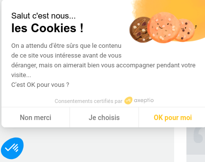
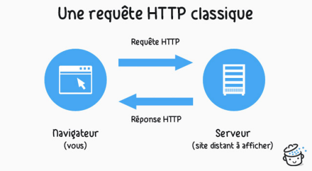

??? quote "Sources"
    - [lyc-la-martiniere-diderot.ac-lyon.fr](https://portail.lyc-la-martiniere-diderot.ac-lyon.fr/srv20/co/AA3_-_Securite_et_Vie_Privee.html)

# Sécurité et vie privée sur le web

## Qu'est-ce que la CNIL ?

!!! note "Question 1"
    En faisant une recherche sur **Wikipédia** (avec votre *téléphone*), donner la signification de l'acronyme **CNIL**.

??? tip "Réponse question 1"
    La **CNIL** est la **Commission Nationale de l’Informatique et des Libertés**.

!!! abstract ""
    Le 21 mars 1974, le journal quotidien Le Monde révèle un projet gouvernemental souhaitant identifier chaque citoyen par un numéro et d'interconnecter, via ce numéro, tous les fichiers de l'administration.

    Cette révélation crée une vive émotion dans l'opinion publique !

    Et c'est ainsi que la CNIL est née, portée par la loi relative à l'informatique, aux fichiers et aux libertés du 6 janvier 1978 qui constitue le fondement de la protection des données à caractère personnel dans les traitements informatiques mis en œuvre sur le territoire français. 

!!! note "Question 2"
    Toujours à partir de la page **Wikipédia**, quel est le **rôle de la CNIL** ?

??? tip "Réponse question 2"
    La **CNIL** protège les données personnelles et garantit les droits liés à la vie privée des citoyens face à l’utilisation de leurs données.

!!! note "Question 3"
    Quel règlement a été ensuite voté par le **Parlement Européen** le *14 avril 2016* ?  
    Donner le nom et l'acronyme.

??? tip "Réponse question 3"
    Le règlement voté par le Parlement Européen le *14 avril 2016* est le **Règlement Général sur la Protection des Données** (**RGPD**).

!!! note "Question 4"
    À quelle date ce règlement a été effectivement appliqué ?

??? tip "Réponse question 4"
    Ce règlement a été appliqué à partir du *25 mai 2018*.

## Mode de navigation privée

Lire l'article d'URL [https://support.mozilla.org/fr/kb/idees-recues-sur-navigation-privee](https://support.mozilla.org/fr/kb/idees-recues-sur-navigation-privee) et répondre aux 2 questions suivantes sur votre document réponse :

!!! note "Question 5"
    Lorsque je navigue en mode privé, qui peut ou ne peut pas accéder aux traces numériques laissées pendant ma navigation ?

??? tip "Réponse question 5"
    En mode privé, les sites web visités, les fournisseurs d’accès à Internet et les administrateurs réseau peuvent toujours accéder aux traces numériques. Cependant, ces traces ne sont pas stockées localement dans l’historique du navigateur.

!!! note "Question 6"
    Dans quelle(s) situation(s) ce mode peut-il constituer une protection intéressante de mes données personnelles ?

??? tip "Réponse question 6"
    Le mode privé est utile pour éviter de stocker localement l’historique de navigation, les cookies ou les données de connexion, notamment sur des appareils partagés ou publics.
    
## Bien comprendre les cookies

{ width="300px" }

### Introduction aux cookies

Visionnez la vidéo suivante :

À partir de cette vidéo, répondre aux questions suivantes :

!!! note "Question 7"
    En informatique, qu'appelle-t-on un cookie ?

??? tip "Réponse question 7"
    Un **cookie** est un fichier stocké sur l’ordinateur d’un internaute par un site web pour conserver des informations sur sa navigation ou ses préférences.

!!! note "Question 8"
    Les cookies sont-ils bons ou mauvais pour l’internaute ?

??? tip "Réponse question 8"
    Les **cookies** peuvent être à la fois **utiles** (personnalisation, sauvegarde des connexions) et **intrusifs** (traçage à des fins publicitaires). Leur impact dépend de leur usage.

!!! note "Question 9"
    Comment peut-on bloquer les cookies déposés par les sites tiers ?

??? tip "Réponse question 9"
    On peut bloquer les **cookies tiers** en modifiant les **paramètres du navigateur** ou via des **extensions** dédiées, comme "I still don't care about cookies".

!!! note "Question 10"
    L'utilisation de cookies par les sites Web est-elle réglementée ?

??? tip "Réponse question 10"
    Oui, l’utilisation des cookies est réglementée, notamment par le **RGPD** et la directive européenne **ePrivacy**, qui imposent le consentement éclairé des utilisateurs.

Sur votre **téléphone**, allez sur le site [leprogres.fr](https://leprogres.fr), puis répondez aux questions suivantes.

!!! note "Question 11"
    Quelles sont les différentes utilisations de données effectuées par ce site et ses partenaires que vous pouvez immédiatement lire sur ce bandeau ?

??? tip "Réponse question 11"
    Le site *Le Progrès* et ses partenaires collectent des données pour des finalités comme la personnalisation des publicités, la mesure de l’audience, et l’amélioration des contenus.

!!! note "Question 12"
    Quels sont les paramétrages possibles pour l'utilisateur ?

??? tip "Réponse question 12"
    L’utilisateur peut **accepter tous les cookies**, les **refuser**, ou **personnaliser** les paramètres en choisissant quelles données sont collectées.

### Justification des cookies...

!!! note "Question 13"
    Ce site respecte l'obligation légale de demande de consentement pour le dépôt de cookies sur la machine du visiteur, mais pensez-vous que celui-ci est bien informé lors de sa première visite ?

??? tip "Réponse question 13"
    Le site informe l’utilisateur de la collecte des données, mais le niveau de clarté et d’accessibilité des informations peut influencer la perception d’un consentement éclairé.

Choisir un paramétrage et cliquer sur le lien d'URL https://www.leprogres.fr/protection-des-donnees situé tout en bas de la page puis lire la note d'information

!!! note "Question 14"
    Quels sont les arguments du site pour déconseiller le blocage des cookies ?

??? tip "Réponse question 14"
    Le site argue que bloquer les cookies peut **limiter certaines fonctionnalités**, réduire la **pertinence des publicités** et compromettre la **personnalisation des services**.

## Sécurité minimale dans un navigateur

### Fonctionnement du protocole HTTP

!!! abstract ""
    Le protocole HTTP permet d'échanger des pages Web dans une interaction entre un client (le navigateur web) et le serveur sur internet :

    { width="350px" }

!!! warning "Protocole non chiffré"
    Mais attention, il s'agit d'un **protocole non chiffré** c'est-à-dire que toutes les données sont transférées *en clair* entre le client (généralement le navigateur) et le serveur.

    C'est pourquoi il a été inventé le **protocole HTTPS**.

    Le **protocole HTTPS** fonctionne en ajoutant une *couche de sécurité* supplémentaire à l'aide d'un *certificat SSL*. Le professeur va vous montrer une vidéo sur le *certificat SSL*.

!!! note "Question 15"
    Après visionnage de la vidéo, répondez à la **question suivante** :
    Qu'est-ce qu'un **certificat SSL** et à quoi sert-il ?

??? tip "Réponse question 15"
    Un **certificat SSL** (Secure Sockets Layer) assure la **sécurisation des échanges** de données entre un utilisateur et un site web en **cryptant les informations**, garantissant ainsi leur **confidentialité**.